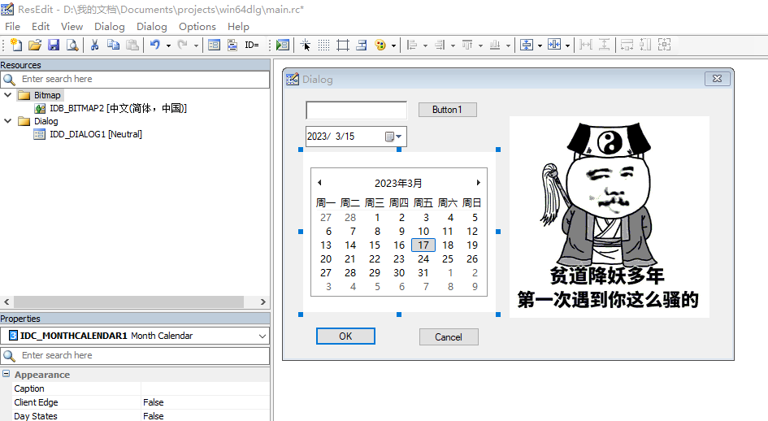
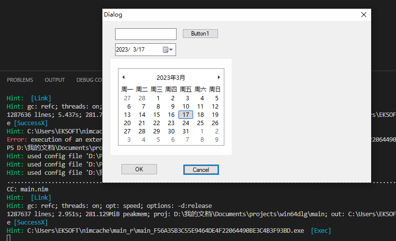
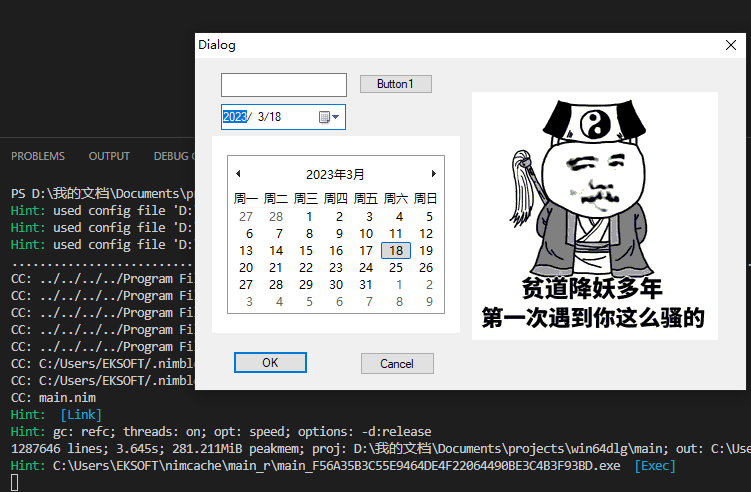

最近Golang玩的很嗨，现代的C语言不是盖的。唯一有点不爽的就是golang是专为高并发设计的，每次启动都一堆线程。在htop下看着很不爽。有没有一种写起来爽，又是编译型语言，速度也可以的语言呢？

当然有，Nim算是其中之一吧。并且这个语言比较像Python，也是缩进语法的语言。先来个例子感受下语法：

```python
import time

def fib(n):
    if n==0:
        return 0
    if n==1:
        return 1
    return fib(n-1)+fib(n-2)
t=time.time()
print(fib(40))
print(time.time()-t)
```

错了错了，这是python。下边才是Nim

```nim
import times

proc fib(n:int):int=
  if n==0:
    return 0
  if n==1:
    return 1
  return fib(n-1)+fib(n-2)

var t=times.cpuTime()
echo fib(40)
echo times.cputime()-t
```

可以看到是不是有点像Golang跟python的结合体？

顺便贴一下测试结果：

```bash
[yafeng@SongSrv fibn]$ python fib.py
102334155
69.87282729148865
[yafeng@SongSrv fibn]$ pypy3 fib.py
102334155
13.181118726730347
[yafeng@SongSrv fibn]$ go run fib.go
102334155
1.237680831s
[yafeng@SongSrv fibn]$ g++  fib.cpp && ./a.out
102334155
1.99962 sec
[yafeng@SongSrv fibn]$ g++ -O3 fib.cpp && ./a.out秒，
102334155
0.373478 sec
[yafeng@SongSrv fibn]$ nim  r fib.nim
102334155
3.16008495
[yafeng@SongSrv fibn]$ nim -d:release r fib.nim
102334155
1.067569256
[yafeng@SongSrv fibn]$ nim -d:danger r fib.nim
102334155
0.017291094
```

python 70秒，pypy 13秒，go 1.2秒，g++不优化2秒，优化0.3秒。

nim的话，debug模式3秒，release模式1秒，danger模式0.017秒。速度还是可以接受的。

nim由于是编译型的语言，这给我们写简单的界面提供了一个非常有利的条件：使用资源文件。

首先，用ResEdit建立一个资源文件，并且设计一个简单的界面：



保存在nim工程目录下。会发现有一个rc文件一个头文件。

```cpp
// Generated by ResEdit 1.6.6
// Copyright (C) 2006-2015
// http://www.resedit.net

#include <windows.h>
#include <commctrl.h>
#include <richedit.h>
#include "resource.h"

//
// Bitmap resources
//
LANGUAGE LANG_CHINESE, SUBLANG_CHINESE_SIMPLIFIED
IDB_BITMAP2        BITMAP         "..\\..\\..\\Pictures\\f0f7-haichqz5211169.bmp"

//
// Dialog resources
//
LANGUAGE LANG_NEUTRAL, SUBLANG_NEUTRAL
IDD_DIALOG1 DIALOG 0, 0, 367, 204
STYLE DS_3DLOOK | DS_CENTER | DS_MODALFRAME | DS_SHELLFONT | WS_CAPTION | WS_VISIBLE | WS_POPUP | WS_SYSMENU
CAPTION "Dialog"
FONT 8, "Ms Shell Dlg"
{
    CONTROL         "", ID_PIC, WC_STATIC, SS_BITMAP | SS_CENTERIMAGE, 181, 15, 171, 165, WS_EX_LEFT
    CONTROL         "", IDC_DATETIMEPICKER1, DATETIMEPICK_CLASS, WS_TABSTOP | DTS_APPCANPARSE | DTS_RIGHTALIGN, 17, 28, 83, 16, WS_EX_LEFT
    CONTROL         "", IDC_MONTHCALENDAR1, MONTHCAL_CLASS, WS_TABSTOP | MCS_NOTODAY, 11, 48, 165, 121, WS_EX_LEFT
    PUSHBUTTON      "Button1", IDC_BUTTON1, 109, 10, 49, 12, 0, WS_EX_LEFT
    EDITTEXT        IDC_EDIT1, 17, 9, 84, 15, ES_AUTOHSCROLL, WS_EX_LEFT
    PUSHBUTTON      "Cancel", IDCANCEL, 110, 181, 50, 14, 0, WS_EX_LEFT
    DEFPUSHBUTTON   "OK", IDOK, 25, 180, 50, 14, 0, WS_EX_LEFT
}
```

```c
#ifndef IDC_STATIC
#define IDC_STATIC (-1)
#endif

#define IDD_DIALOG1                             100
#define IDB_BITMAP2                             102
#define IDC_EDIT1                               40000
#define IDC_BUTTON1                             40001
#define IDC_DATETIMEPICKER1                     40002
#define IDC_MONTHCALENDAR1                      40003
#define ID_PIC                                  40004
```

第一个文件就是定义了上边那个对话框，第二个文件定义了控件的ID号，我们用mingw自带的windres命令把它编译成资源（res）文件

```bash
windres main.rc -O coff main.res
```

这样就生成了一个名字为main.res的资源文件。下编写代码显示这个对话框：

```nim
import winim
{.link:"main.res".}
proc DlgProc(hwnd: HWND, uMsg: UINT, wParam: WPARAM, lParam: LPARAM): LRESULT {.stdcall.} =
    return FALSE

DialogBox(0, MAKEINTRESOURCE(100),0, DlgProc);
```

首先import一个库叫winim。这个库封装了大部分windows api，让我们可以调用比如DialogBox这样的windows api函数。第二行是个link的pragma，告诉链接器需要把刚才生成的main.res连接到程序里。

接下来定义了一个函数，这是windows对话框的回调函数，先不写任何功能，直接return FALSE即可。

最后一句则是调用DialogBox函数生成对话框，我们来运行它：



可以看到，对话框出来了，但是有俩问题：

1.右上角的关闭按钮不好使，只能通过任务管理器结束。

2.右边那个图片不显示。

所以我们需要改一下那个回调函数，处理窗口的消息。

```nim
import winim
{.link:"main.res".}

proc DlgProc(hwnd: HWND, uMsg: UINT, wParam: WPARAM, lParam: LPARAM): LRESULT {.stdcall.} =
    if uMsg == WM_COMMAND:
        if wParam == ID_CANCEL:
            EndDialog(hwnd,0)

    if uMsg == WM_INITDIALOG:
        var img = LoadBitmap(GetModuleHandle(nil),MAKEINTRESOURCEW(102))
        SendDlgItemMessage(hwnd,40004,STM_SETIMAGE,IMAGE_BITMAP,img)

    return FALSE

DialogBox(0, MAKEINTRESOURCE(100),0, DlgProc);
```

最终效果如图：



这里简单解释下windows GUI的机制。

这类程序叫基于对话框的程序，显示对话框有两类函数：CreateDialog跟DialogBox，其中前者是非堵塞的，需要自己写个消息循环，后者是堵塞的，对话框退出，函数才会返回。

对话框上点击各个按钮或者输入，程序都会给回调函数发消息。DialogBox函数会发给最后一个参数指定的函数，这个过程叫CALL BACK，也叫回调。

该函数有4个参数：本窗口的句柄（类似ID号），消息类型，消息内容WPARAM，消息内容LPARAM

比如点击Cancel按钮（同时也是右上角的×号），对话框会发出WM\_COMMAND消息，第二个参数则包含了该控件的ID号。

所以用if语句判断一下，调用EndDialog结束对话框即可。如果程序写的复杂，可以用case of语句来处理消息，比如写成如下样子：

```nim
proc DlgProc(hwnd: HWND, uMsg: UINT, wParam: WPARAM, lParam: LPARAM): LRESULT {.stdcall.} =
    case uMsg
        of WM_COMMAND:
            case wParam
                of 2:
                    EndDialog(hwnd,0)
                of 1:
                    MessageBox(hwnd,"Hello World","hello",MB_OK)
                else:
                    discard
        of WM_INITDIALOG:
            var img = LoadBitmap(GetModuleHandle(nil),MAKEINTRESOURCEW(102))
            SendDlgItemMessage(hwnd,40004,STM_SETIMAGE,IMAGE_BITMAP,img)
        else:
            discard
    return FALSE
```

