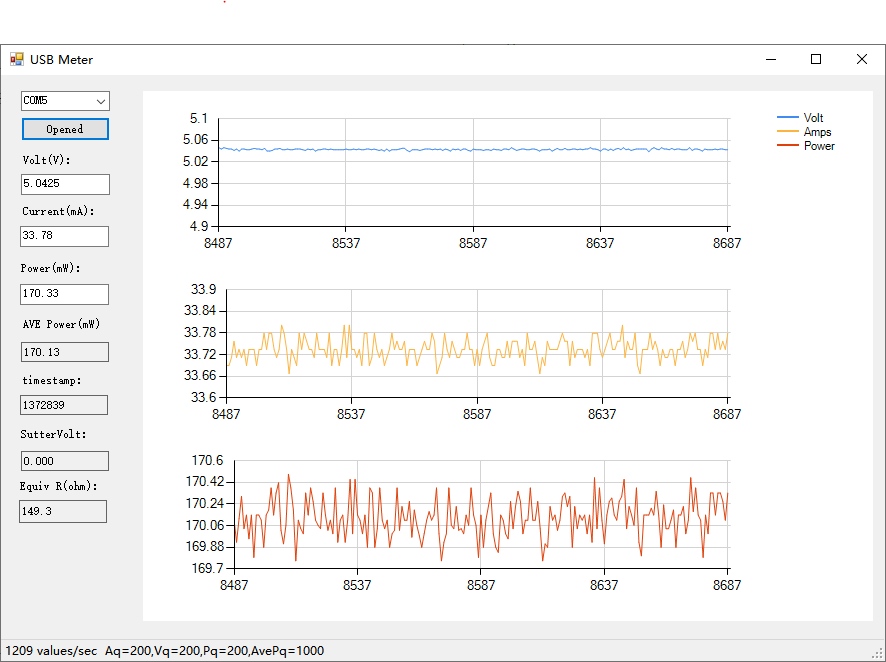
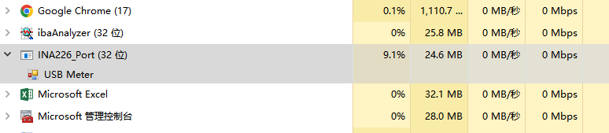
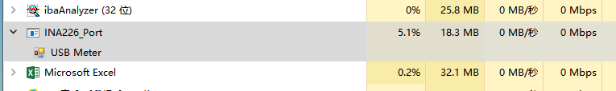
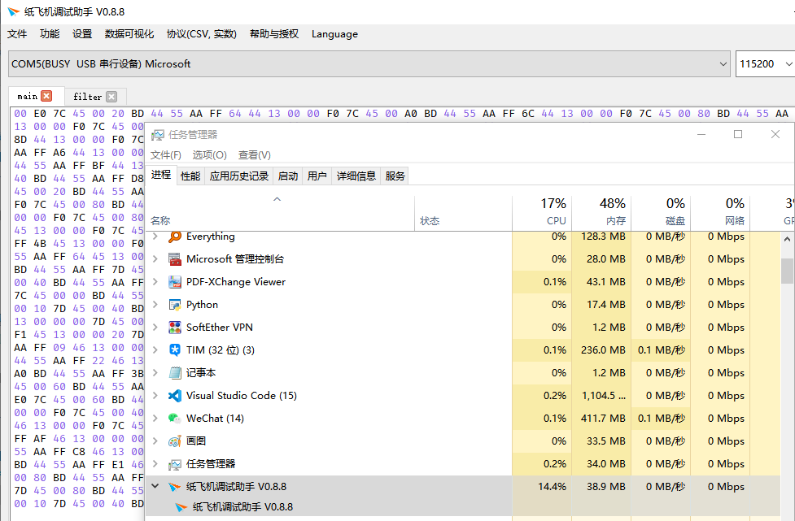

书接上回，我不是搞了两块INA226的小板子么，下位机调通了，当然下一步就是上位机搞起，祭出C#+winforms三下五除二……如下图：



好吧，丑是丑了点，winforms默认就是这B样。不就是玩玩么，玩的就是多快好省……巴拉巴拉……

回正题，我们先算了算，INA226最快的转换时间是140us，需要读2个数据，就是电压、电流。也就是最快140+140=280us，加上处理，发送的时间，算他300us吧，也就是1ms的时间能够采集3+次，那一秒就得收3000+个数据。

简单算一下：32\*3000=96000也就是96K，常用串口的115200波特率勉强够用。另外还有USB通讯，现在的单片机一般支持USB2.0全速通讯，也就是12Mbps/s。串口的话一般CH340也能达到1M左右，基本是毫无压力。基于简单通用考虑

当然是选串口了，另外这些单片机带的VCP是很快的，起码有3M/s的速度。

问题出在windows上。众所周知，windows/linux这些OS都不是实时的。一个时间片通常是1ms，但是这不是固定的，有时也会10几ms不等，所以windows下接收数据需要缓冲区也就是高速设备发来的数据，我windows底层先收着，存在一个区域。

等你程序来了一次性拿走就行了，所以即使windows能保证精确的1ms让你读一次串口，1毫秒也能读到3组数据。何况他根本保证不了，所以每次从串口读到的都是一堆数据并且因为发送的不是一个字节啊，还会出现读一半的情况。比如发送的一帧长度是20字节，你读上来30字节，前20字节是一完整的数据帧，后边10个字节是半个数据帧，还要跟后续读取的10个字节组成完整的数据帧。所以得想办法解决粘包的问题。还有一个就是时间问题，假设一次读到10个数据帧，这10个数据帧是同一个时间读到的，就不知道每个数据产生的具体时间了。

先说说时间问题，前一阵子研究怎么给FNB58写一个客户端当时考虑过，FNB58是USBHID接口，这个接口最大的好处就是免驱，插上电脑就能用，并且如果早知道PID/VID的话可以写死在程序里，软件打开可以直接连接，不用选端口（串口就不行了，你插上他不一定是串口几了，需要自己选一下）USBHID的话是1ms一个64字节的数据帧，也就是500Kbps的样子，比串口慢，但是够用。他是1帧发送四组数据。平均10ms一个点，也就是大约40ms上报一个数据帧（其实我就是嫌它慢才会自己搞INA226）。因为当时参考了github上一个项目https://github.com/baryluk/fnirsi-usb-power-data-logger里边是这么处理的：

每次读到数据后，比如100ms读一次，读到了10个点，那么我把10个点平均分配到这100ms之内就可以了，其实这样的话慢速还行，因为windows的实时性能保证40ms读一个数据帧，基本时间误差比较小。但是速度上去后，时间偏移就会比较大，另外一个稍微理想的方案就是上传的数据自带时间戳，这样就比较好了，我无论一次读到多少数据，反正自带时间，稍微处理下就能当时间用。然后问题又来了：你单片机时钟准吗？你如何保证现在单片机的时间是UTC（或者localtime）时间？时间戳精度够用吗？MD越来越复杂了……

其实windows（或者安卓等其他设备）的时钟也是靠一个晶振产生的，其实也是不准的，但是架不住他们用网络对时，只要有网，他会每隔一段时间从网上获取时间对一下时间，所以windows（或者安卓之类）的时间是比较准的。后来嘛，我发现我想的有点多……你晶振再不准，也不会一天差一个小时吧……也就是差几分钟的精度，我又不记录那么长时间的记录，真要计那么多数据，那一般也不会需要那么高的采样率了（因为我试过给数据记log，开几十秒能记几兆的数据，时间长的话还不得把硬盘塞满……）。再就是时间戳精度问题，因为数据采集时间时低于1ms的，所以需要精确到us，那么32位的时间戳多少时间溢出呢1.19小时……要是记录手机充电的话，还真不怎么够，好在最快140us才一个点，精确的到10us的话就能11.9小时，100us的话就是119小时。足够了（当然可以用64位的时间戳，那样时间就是天文数字了，用32位是为了节省点通讯带宽）。经过一番思考，决定把协议弄成这个样子：

AA FF+XXXX XXXX（时间戳UINT）+XXXX XXXX（电压FLOAT）+ XXXX XXXX（电流FLOAT）+55，也就是15字节，其实还可以简化，比如包头只有AA，包尾也可以去掉，电压电流可以传16位的整型那样9字节就够了。之所以搞成这样，原因比较复杂，因为我一会儿想在单片机上标定电流，一会儿想在上位机上，所以频繁的改协议，后来想想干脆浮点数算了，先定下来再说。

至于字头为啥用了两个，这个说出来丢人，因为一开始吧为了解决粘包问题，我用了两个线程+一个队列，一个线程收，收到后扔到队列，一个线程解析协议从队列取值（网上这么教我的），后来发现，频繁的解包出错甚至在包头AA FF正确的时候，收到的电压电流乱跳，后来又加了个包尾，才能保证每次读到的数据都正确（但是通过记录失败的次数，每秒都有大量的错误次数）直到我意识到我用的队列是线程不安全的……开始是换了C#自带的ConcurrentQueue，错误立刻就降到了0，后来嫌CPU占用率高，想到虽然队列线程安全，但是肯定会在锁上竞争，把接收跟解包放到了一个线程，再到后来想到系统的串口缓冲区其实也是一个队列，所以就干脆把队列取消了……代码如下的样子：

```
            byte Dequeue;
            
            if (serial.IsOpen && serial.BytesToRead>0)
            {while(serial.BytesToRead>=15)
                {
                    Dequeue=(byte)serial.ReadByte();;
                    if (Dequeue==0xAA)
                    {
                        Dequeue=(byte)serial.ReadByte();
                        if (Dequeue==0xFF)
                        {
                            for(int i=0;i<=11;i++)
                            {
                                result[i]=(byte)serial.ReadByte();
                            }
                            
                            Dequeue=(byte)serial.ReadByte();
                            if (Dequeue==0x55)
                            {
                                timestamp = BitConverter.ToUInt32(result,0);
                                voltage = BitConverter.ToSingle(result,4)*1.25/1000;
                                current = BitConverter.ToSingle(result,8)*2.24/100;
                                power = voltage*current;
                                rev_frame_counter++;
                            }
                            else
                            {
                                err_frame_counter++;
                            }
                        }
                    }
                }
            }
```

首先判断串口缓冲区是不是大于等于15个字节（因为协议是15字节），如果有足够的字节数，就先读一个字节，判断是不是帧头（0xAA），为啥用了俩字头呢，因为数据里也可能有0xAA这个数据啊，如果检测到0xAA就直接读剩下的14字节，最后发现不对就至少丢掉两个帧的数据，数据里AA FF这样的可能性就很小了，当然也可以AA BB，都无所谓，验证帧头正确然后读12个字节的数据，一个整数(时间戳)，两个浮点数（电压，电流），至于功率就是电压x电流，最后验证字尾是不是正确。

如果不对就丢掉，对的话就解码。

可以看到没有用队列（利用了串口缓冲区自己就是队列的特点）。

这样可以做到0出错，0丢包（当然排除串口传输出错的情况）。当然帧尾可以用校验和，或者CRC之类的代替固定值，那样能更大限度的保证数据的正确性。我没这么干主要是嫌CPU占用率高。

回到最开始的图，每秒只能接收1200帧数据，也就是每ms一个多一点的数据，是因为这个单片机我用的RP2040（以前从来没用过，只是看到这个板子能焊到我做的PCB上，就直接买了），硬件I2C针脚跟我的板子不兼容，所以只能用软件I2C协议

读的比较慢，得300多us才能读一个值，1200帧/秒已经是极限了。这时候我电脑CPU占用率10%左右。



后来发现编译成64位程序能大幅下降CPU占有率：



本来琢磨着是不是用C++能减少点CPU占用，后来发现……



C++这么没有牌面的么……这个调试助手可是C++ QT方案，这都没开曲线呢……所以就懒得C++去写了，当然我相信C++能比C#省点CPU。

 这里我有点理解为啥那些U表为啥一般只支持10ms一个点的上报频率了，CPU占用是真降不下来啊，现在都是笔记本电脑，15%的占用率风扇呼呼响啊，这体验真不咋地。

经测试，10ms一个数据的话，CPU占用能在1%以下，能有个不错的体验。还有就是测个功率，10ms一个点也够用了。

后记：我换了个调试助手，跟纸飞机差不多的Vofa+，用RAW协议的话，CPU占用率3-4%的样子，但是这个软件没有统计数据，不知道有没有丢数据之类，可能这才是C++应有的性能吧。
