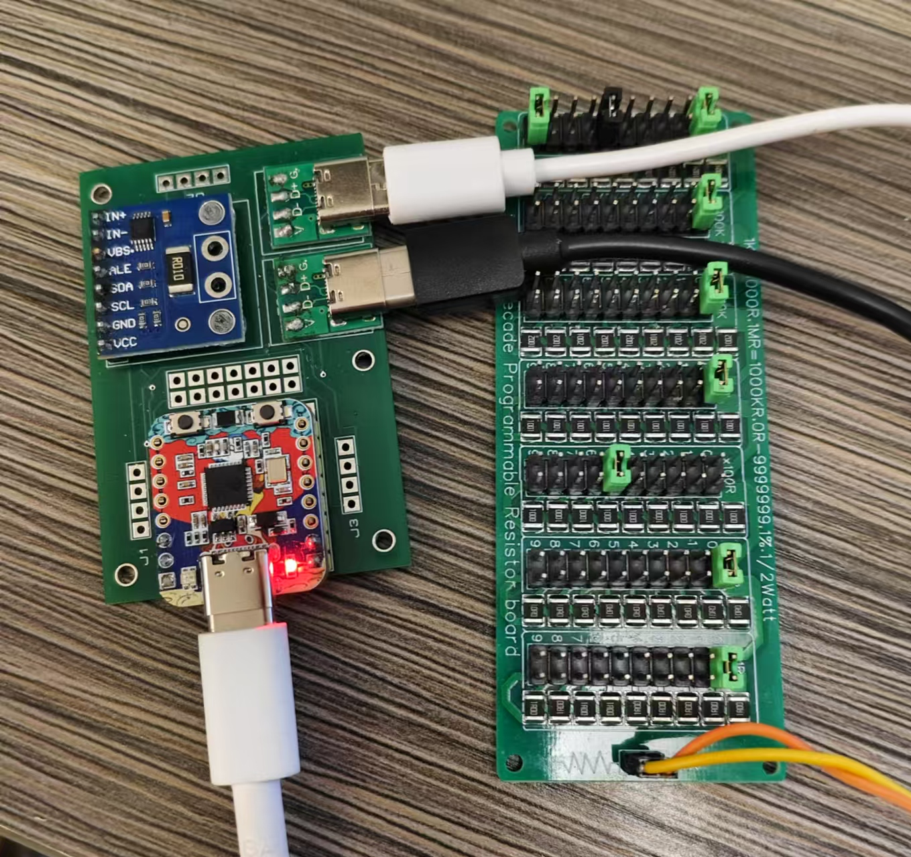

接上文，接个500欧的电阻作为负载：



```python
>>> i2c.readfrom_mem(64,1,2).hex()
'005a'
>>> int(0x5a)
90
```

按照模块上采样电阻0.01欧来算：

90\*81.92mV/32768=0.225mV

0.225mV/0.01Ω=22.5mA

但是，5V，500欧，应该是10mA，所以……

电阻大了一倍有余，放大系数为2.25……

电阻换成100欧

```python
>>> i2c.readfrom_mem(64,1,2).hex()
'01ba'
>>> int(0x1ba)
442
```

442\*81.92mV/32768 = 1.105mV

1.105/0.01 = 110.05mA

实际应该是50ma，放大系数为2.21

继续改变电阻，为200欧

```python
>>> i2c.readfrom_mem(64,1,2).hex()
'00dd'
>>> int(0xdd)
221
```

系数2.21

改编为50欧：

```python
>>> i2c.readfrom_mem(64,1,2).hex()
'0367'
>>> int(0x367)
871
```

系数为2.177

因为负载也有精度问题。经多次测量，系数大约2.2左右。

所以程序如下：

```python
import micropython

i2c = I2C(0, scl=Pin(8), sda=Pin(9), freq=1000000)
i2c.writeto_mem(64,0,b"\x41\x27")

@micropython.native
def read_ina226():
    while True:
        ret1 = i2c.readfrom_mem(64,1,2)
        ret2 = i2c.readfrom_mem(64,2,2)
        current = struct.unpack(">h",ret1)[0]*0.113
        voltage = struct.unpack(">h",ret2)[0]*1.25/1000
        print("voltage={0}V,current={1}mA,power={2}mW,R={3}".format(voltage,current,voltage*current,1000*voltage/current))
        time.sleep(1)

read_ina226()
```

MPY: soft reboot  
voltage=5.07125V,current=25.086mA,power=127.2174mW,R=202.1546  
voltage=5.07125V,current=24.973mA,power=126.6443mW,R=203.0693  
voltage=5.07125V,current=24.973mA,power=126.6443mW,R=203.0693  
voltage=5.0725V,current=25.086mA,power=127.2487mW,R=202.2044  
voltage=5.07125V,current=24.973mA,power=126.6443mW,R=203.0693  
voltage=5.07125V,current=24.973mA,power=126.6443mW,R=203.0693  
voltage=5.07125V,current=24.973mA,power=126.6443mW,R=203.0693  
voltage=5.07125V,current=24.86mA,power=126.0713mW,R=203.9924  
voltage=5.07125V,current=24.86mA,power=126.0713mW,R=203.9924
