其实本文所有的内容在Archwiki上都可以找到，并且更新更全面（只是比较零散），我所做的只是对安装流程做一个小小的总结，每一步我都会稍微解释一下，但不会说的特别详细，毕竟这只是一篇安装引导文，而不是Wiki。

首先显然是下载最新的archlinux安装镜像：

1，用浏览器打开archlinux源，比如mirrors.163.com,mirrors.ustc.edu.cn(这里以163为例)：（url）[http://mirrors.163.com/archlinux/](http://mirrors.163.com/archlinux/ "http://mirrors.163.com/archlinux/")

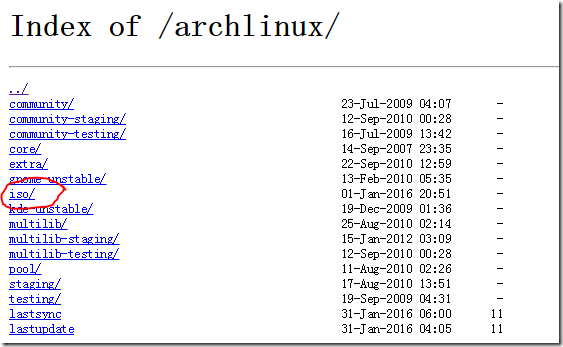

可以看到，有个iso目录，这就是安装镜像所在的地址了。打开后里边是这个样子的：

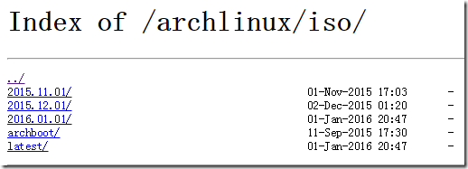

其中latest目录下，是包含官方最新的archlive镜像，而archboot目录下，则是另一个版本的archboot镜像（以前的archlinux官方镜像，包含一个类似FreeBSD的图形化安装脚本哦，感兴趣的童鞋可以试试，感觉还是比较好用哦）。不多说了，还是进latest下载安装镜像(直接扔地址：)[http://mirrors.163.com/archlinux/iso/latest/archlinux-2016.01.01-dual.iso](http://mirrors.163.com/archlinux/iso/latest/archlinux-2016.01.01-dual.iso "http://mirrors.163.com/archlinux/iso/latest/archlinux-2016.01.01-dual.iso")（建还是自己进去下哦，说不定你看到本文时，2016年2月甚至2017年的镜像已经出了，建议下载最新的）

600多兆，时间比较漫长，我就先八一下怎么做安装USB，要是你用linux系统，直接dd进U盘就行了（命令我不多说了我觉得linux用户应该都会，不会的google baidu一下也会了，另一个方法就是男人（man）一下dd（搞基？），咱还是策反windows下的众linux小白为主）。

考虑到网上众基们用ultra iso做启动盘的比较多，我就顺应民意用一下这个软件：

用ultra iso打开刚才下载好的镜像文件，选择启动->写入硬盘镜像

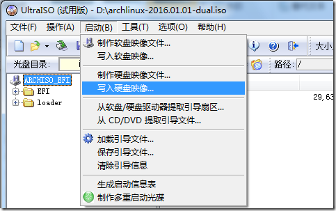

并在接下来的窗口选择RAW写入：

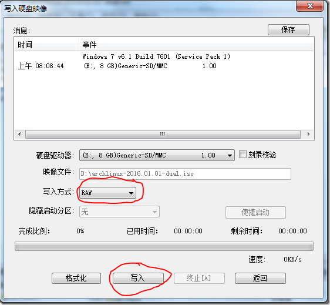

等一会儿，就写完了（要是启动失败，请移步互联网，找更靠谱的方法，（因为这不是重点））

假设在座各位已经搞定了启动方法，下边就是安装了（我用的vbox虚拟机）

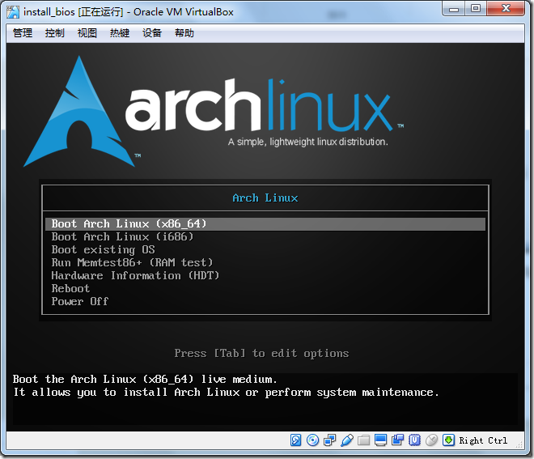

嗯，现在的电脑都支持x86\_64(amd64),只要电脑不太差，选这个就OK了，内存小，可以选i686可以省内存哦（上下箭头选择，回车继续，不用我教吧）。

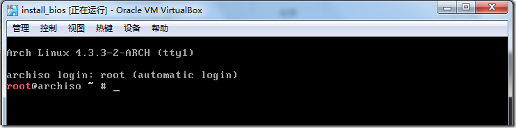

嗯嗯，看到一个命令行界面输一个lsblk看看有没认到硬盘：

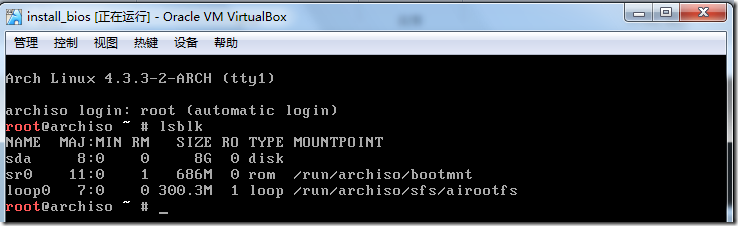

那个sda就是硬盘了。分区cfdisk /dev/sda,在接下来的界面选dos（也可能没这个界面）

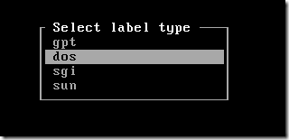

然后new一个分区（这里我是把所有空间都给我们的btrfs分区了，各位看官按需分区，按需分区嗯）并加上boot标志（以防有些sb主板只认有boot标志的硬盘）：

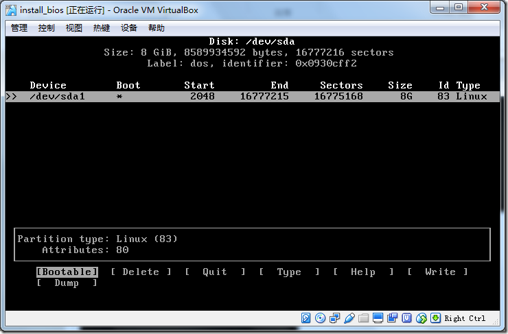

然后选“Write”写入，选“Quit”退出。注意上边那个Start，一定要是2048或以上（比如4096 8192……），否则btrfs无法作为启动分区，什么你的是64？那……换个别的工具分区吧……

再lsblk，我们看到了sda1，分区搞定。

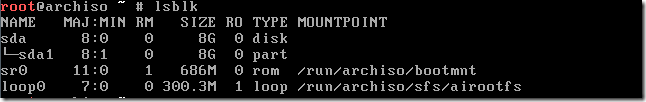

下一步就是格式化了，好激动，千万不要格式化错了分区哦（看官：你妹的在虚拟机下激动个P，就一个分区……）

```
mkfs.btrfs /dev/sdaX
```

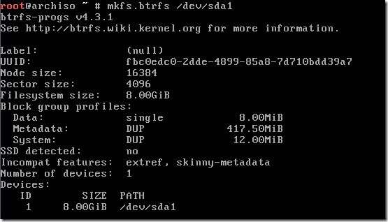

看到这个提示，说明格式化成功了。接下来，建立子卷：

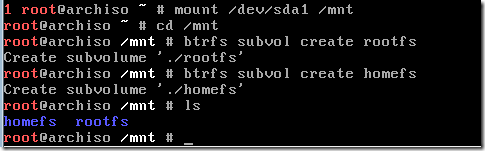

我建立了rootfs子卷作为archlinux的/，建立了homefs作为/home,接下来就是挂载：

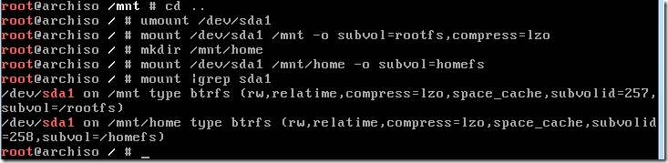

解释一下：先cd ..跳出/mnt目录然后umount（卸载）掉sda1(不cd出去会umount失败)，然后把rootfs子卷挂载到/mnt,然后建立/mnt/home目录，挂载homefs到/mnt/home，最后用mount命令查看一下挂载是不是成功了。

至于挂载参数，我作为例子，只用了一个compress=lzo，也就是用lzo模式压缩卷，lzo是一种先进的压缩实时算法，能减少磁盘占用，提升硬盘性能哦，当然如果系统装在SD卡等特别慢的设备上，我推荐zlib算法，牺牲部分CPU性能换硬盘速度，因为zlib压缩率高，比如把原来100M的文件压缩成了50M，读写显然就只用原来一半的时间，很好理解。

其他挂载参数，抄一下wiki上的：

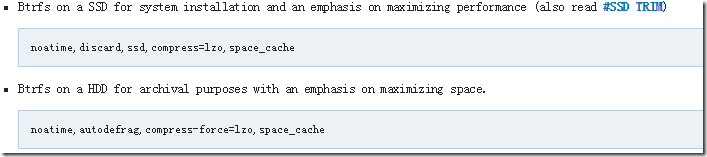

依照你是SSD还是HDD，各取所需了吧。另外，稍微提一下，btrfs现在不支持各个子卷用不同的参数挂载，所以只有第一个子卷挂载时需要上边的罗哩罗嗦的一堆参数，比如上边我挂载home时，就只加了个subvol参数，指定子卷，其他会默认跟rootfs的一样。

挂载好了，下一步就是安装了，先编辑一下


把你最快的源放在最前边，比如我是用的163为例子：

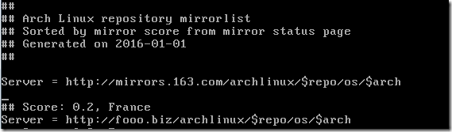

然后就是安装基本系统：

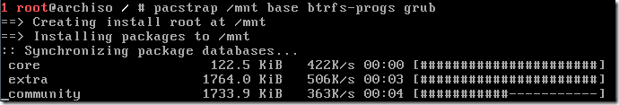

我安装了base btrfs-progs grub三项，要是需要wifi-menu连无线，还需要架上wpa\_actiond dialog，嗯，安装个很快，几分钟就装完了。

好了，下一步生成fstab与grub启动项：

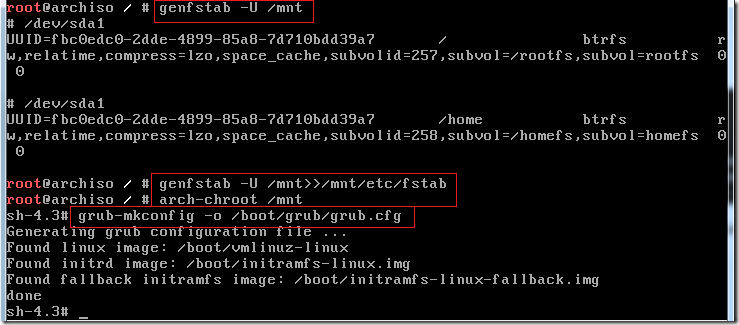

嗯，命令我都用红框框出来啦，一定按顺序，别敲错了。

第一步用genfstab –U /mnt来查看生成的fstab项，如果没问题，第二步就是用>>符号把这些写到/mnt下的/etc/fstab（为什么是mnt下的呢？）。

然后用chroot后用grub-mkconfig生成grub菜单。并导入grub.cfg

最后一步，安装grub到mbr：

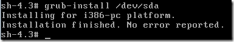

嗯，注意最后一行，有No error reported，就说明安装成功了。

接下来重启就OK了

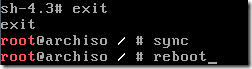

先exit退出chroot环境，然后sync一下（不做其实也无所谓），然后reboot

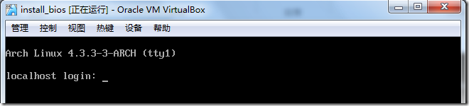

启动成功，用root登录，密码为空

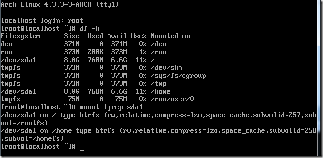

嗯，现在系统768M，好大
