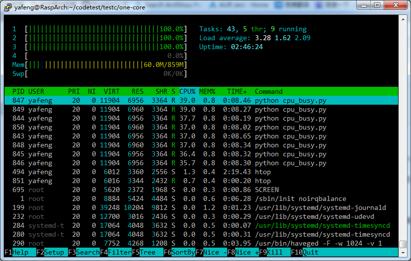

**树莓派提高实时性的新思路**

by yafeng 转载请注明

     树莓派是一台应用linux系统的ARM电脑，由于linux是非实时性系统，所以各个任务之间会不停的切换，时间片20ms-100ms不等，所以很难获得实时的输出，这里先贴个小例子，内容很简单，把一个IO点置为高电平，等待1000us（1ms）然后置为低电平，并记录需要的时间，记录10000次（2ms\*10000=20秒）。

```
#include "stdio.h"
#include "wiringPi.h"
#define rec_num 10000

int main(){
    int time_arry[rec_num];
    int current_time=0;
    wiringPiSetup();
    pinMode(0,OUTPUT);
    for(int i=0;i<rec_num;i++){
        current_time=micros();
        digitalWrite(0,HIGH);
        delayMicroseconds(1000);
        digitalWrite(0,LOW);
        delayMicroseconds(1000);
        time_arry[i]=micros()-current_time;
        }
    for(int j=0;j<rec_num;j++){
        printf("%d ",time_arry[j]);
        }

    }
```

代码很简单，最后打印10000次时间结果，单位为微秒,部分结果如下：

```
$ gcc set_io_pluse_nort.c -lwiringPi
$ sudo ./a.out
2189 2127 2127 2128 2127 2126 2125 2125 2128 2126 2125 2126 2126 2128 2126 2126 2125 2133 2134 2133 2132 2132 2134 2132 2132 2133 2132 2134 2133 2132 2132 2133 2132 2133 2132 2132 2135 2132 2132 2132 2132 2133 2131 2132 2133 2137 2133 2132 2132 2131 2133 2132 2132 2132 2132 2133 2132 2132 2132 2137 2126 2126 2125 2126 2132 2133 2132 2132 2132 2133 2134 2133 2132 2132 2133 2132 2132 2132 2133 2132 2132 2132 2132 2133 2132 2132 2131 2132 2135 2126 2126 2125 2130 2132 2131 2131 2131 2133 2131 2131 2131 2132 2138 2131 2132 2131 2132 2132 2131 2131 2131 2132 2131 2133 2132 2131 2128 2126 2125 2125 2129 2128 2127 2126 2131 2129 2126 2125 2125 2126 2129 2126 2126 2126 2125 2128 2126 2126 2126 2128 2127 2126 2126 2125 2134 2155 2140 2139 2138 2138 2138 2138 2137 2137 2139 2137 2136 2136 21
```

由于数据太多，不容易看出结果，所以我用Python写了个统计结果的程序，分析均值以及偏差。代码很简单，我就不贴出来了，只贴结果：

```bash
平均时间:  2132
<10us: 9621
>10us: 282
>20us: 49
>30us: 19
>40us: 7
>50us: 4
>60us: 2
>70us: 2
>80us: 2
>90us: 2
>100us: 2
>110us: 2
>120us: [2488, 2346]
```

可以看出，现在结果还是不错的，只有2个结果误差超过均值60us，但是平均时间是2.132ms，跟预计时间有132us的误差。

下边是该程序在CPU满载的情况下的测试结果（我写了个多进程程序，把所有CPU撑到100%）：

```bash
平均时间:  2128
<10us: 73
>10us: 9902
>20us: 175
>30us: 153
>40us: 71
>50us: 24
>60us: 15
>70us: 15
>80us: 15
>90us: 15
>100us: 15
>110us: 15
>120us: [12448, 5813, 9480, 13708, 7936, 11588, 14554, 10433, 13771, 14565, 12347, 5887, 9486, 13725, 2955]
```

这时，出现了非常差的情况，15次误差大于120us，并且有多次10-15ms误差的！

然后是下载过程中的测试：

```bash
平均时间:  2139
<10us: 6970
>10us: 2827
>20us: 592
>30us: 381
>40us: 338
>50us: 306
>60us: 280
>70us: 261
>80us: 243
>90us: 224
>100us: 213
>110us: 197
>120us: [2313, 2351, 2338, 2438, 2378, 2442, 2262, 2328, 2260, 2304, 2329, 2394, 2423, 2268, 2260, 2281, 2433, 2345, 2280, 2286, 2315, 2321, 2300, 2349, 2496, 2322, 2269, 2311, 2271, 2377, 2292, 2428, 2339, 2382, 2284, 2261, 2422, 2295, 2271, 2319, 2309, 2282, 2263, 2313, 2423, 2307, 2344, 2297, 2269, 2287, 2286, 2359, 2453, 2276, 2316, 2377, 2360, 2278, 2405, 2917, 2342, 2302, 2291, 2314, 2351, 2304, 2300, 2324, 2262, 2345, 2329, 2440, 2452, 2379, 2287, 2282, 2303, 2341, 2324, 2260, 2299, 2319, 2312, 2281, 2326, 2544, 2386, 2316, 2347, 2330, 2350, 2284, 2378, 2556, 2357, 2361, 2399, 2306, 2265, 2299, 2281, 2307, 2273, 2298, 2286, 2576, 2278, 2320, 2331, 2275, 2324, 2308, 2351, 2387, 2278, 2268, 2390, 2290, 2436, 2420, 2295, 2375, 2364, 2566, 2452, 2312, 2312, 2377, 2261, 2411, 2453, 2393, 2282, 2284, 2308, 2273, 2302, 2284, 2349, 2336, 2292, 2280, 2310, 2264, 2275, 2276, 2295, 2373, 2284, 2264, 2276, 2403, 2314, 2302, 2300, 2313, 2284, 2304, 2295, 2309, 2290, 2261, 3104, 2302, 2334, 2279, 2320, 2318, 2345, 2323, 2381, 2382, 2329, 2402, 2306, 2347, 2340, 2293, 2433, 2384, 2463, 2861, 2347, 2400, 2324]
```

这时没有太大的偏差，不过超过120us的情况非常多。

先测试到这里，下边我们改进程序：

首先，提高进程的优先级，这个wiringpi库给我们带了个函数：piHiPri(int);99为最高优先级，先把这个加上：

直接贴三次测试结果：

1空载：

```bash
平均时间:  2024
<10us: 9982
>10us: 17
>20us: 13
>30us: 3
>40us: 2
>50us: 0
>60us: 0
>70us: 0
>80us: 0
>90us: 0
>100us: 0
>110us: 0
>120us: []
```

空载这样已经很好了，全部在50us以内，并且平均值也有了巨大的提升，跟预期的2000us只差24us

2 CPU满载：

```bash
平均时间:  2012
<10us: 9984
>10us: 14
>20us: 8
>30us: 5
>40us: 4
>50us: 2
>60us: 2
>70us: 2
>80us: 2
>90us: 2
>100us: 2
>110us: 2
>120us: [2210, 2588]
```

3：网络下载：

```bash
平均时间:  2038
<10us: 2726
>10us: 6688
>20us: 156
>30us: 89
>40us: 62
>50us: 55
>60us: 44
>70us: 42
>80us: 33
>90us: 27
>100us: 25
>110us: 24
>120us: [7535, 11448, 7044, 11261, 11124, 6785, 11393, 11141, 7061, 6665, 11633, 11758, 11942, 4090, 2322, 2306, 2286, 2370, 2166, 2334, 2311, 2276, 2339, 2204]
```

可以看到，提高了进程优先级后，改善还是比较大的，平均时间都跟预期时间相差几十us，虽然网络下载时（高IO）时仍然有些误差很大的，但考虑到测试已经是比较极端的状况了，应该还是有很大提升的。这种方法优势就是简单。只加1句代码，就能提升实时性。

那么，还有什么更好的办法提高吗？当然有!下边，给出终极奥义：

**就是在调度器禁用一个核心，也就是本来4核的CPU，我linux调度时只用3个核心，留出一个核心专门跑实时程序，然后把实时任务安排到这个空闲核心上。**

具体做法是在启动时。给内核加参数：isolcpus=x,x为屏蔽的核心，我改成了3，即最后一个CPU。

然后看看htop，可以看到虽然有8个进程跑满CPU，但第四核心始终是0占用：



然后把任务安排到第4个CPU上，代码很简单：

```bash
	cpu_set_t mask;
	CPU_ZERO(&mask);
	CPU_SET(3,&mask);
	if (sched_setaffinity(0,sizeof(mask),&mask)==-1)
			printf("affi set fail!");
```

把任务SET到3上，然后同样做3组测试：

1:空载：

```bash
平均时间:  2022
<10us: 9821
>10us: 174
>20us: 1
>30us: 0
>40us: 0
>50us: 0
>60us: 0
>70us: 0
>80us: 0
>90us: 0
>100us: 0
>110us: 0
>120us: []
```

　　2：满载，居然比空载都好，也是醉了：

```bash
平均时间:  2011
<10us: 9998
>10us: 2
>20us: 1
>30us: 1
>40us: 0
>50us: 0
>60us: 0
>70us: 0
>80us: 0
>90us: 0
>100us: 0
>110us: 0
>120us: []
```

　　3：下载测试

```bash
平均时间:  2022
<10us: 9899
>10us: 97
>20us: 1
>30us: 0
>40us: 0
>50us: 0
>60us: 0
>70us: 0
>80us: 0
>90us: 0
>100us: 0
>110us: 0
>120us: []
```

居然也比空载好，幻觉，一定是幻觉……2333

总之，基本达到了10微秒级的水平。改善还是非常可观的。

 下边给出所有代码：cmdline.txt(改动在最后)

```bash
root=/dev/mmcblk0p2 rw rootwait console=ttyAMA0,115200 console=tty1 selinux=0 plymouth.enable=0 smsc95xx.turbo_mode=N dwc_otg.lpm_enable=0 kgdboc=ttyAMA0,115200 elevator=noop rootflags=subvol=rootfs isolcpus=3 noirqbalance
```

C代码：

```
#define _GNU_SOURCE
#include "stdio.h"
#include "wiringPi.h"
#include "sched.h"
#define rec_num 10000

void get_hight_Pri(){
    cpu_set_t mask;
    CPU_ZERO(&mask);
    CPU_SET(3,&mask);
    if (sched_setaffinity(0,sizeof(mask),&mask)==-1)
            printf("affinity set fail!");
    piHiPri(99);

}

int main(){
    int time_arry[rec_num];
    int current_time=0;
    get_hight_Pri();
    wiringPiSetup();
    pinMode(0,OUTPUT);
    for(int i=0;i<rec_num;i++){
        current_time=micros();
        digitalWrite(0,HIGH);
        delayMicroseconds(1000);
        digitalWrite(0,LOW);
        delayMicroseconds(1000);
        time_arry[i]=micros()-current_time;
        }
    for(int j=0;j<rec_num;j++){
        printf("%d ",time_arry[j]);
        }

    }
```
