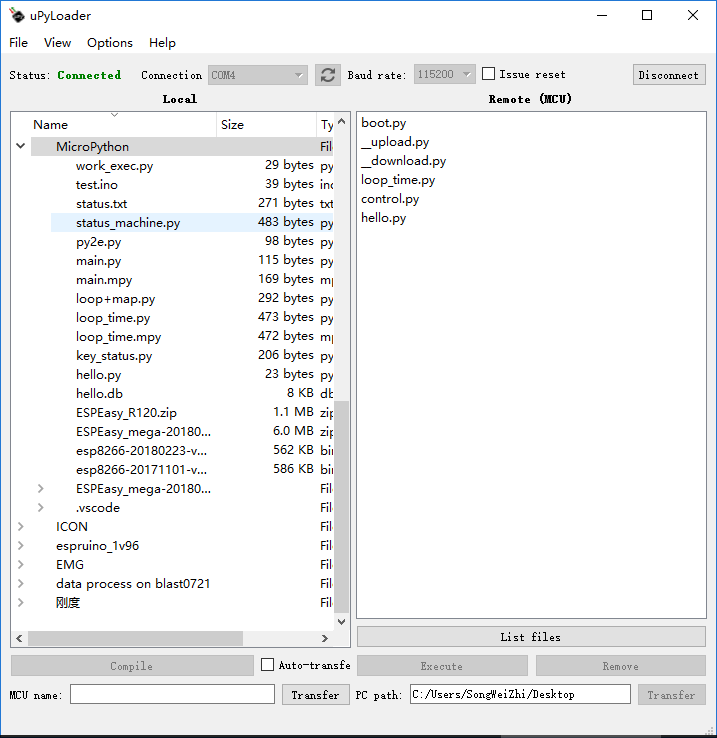

前几篇都是直接在命令上操作，然而执行py文件才是王道，其实类似nodemcu的lua固件，MicroPython也提供了一个简单的文件系统用来存代码。并自动在开机时执行：

boot.py

main,py

两个文件

windows用户的话，推荐一个软件：uPyLoader界面如下



可以看到，左边是本地的文件，右边是ESP8266的文件，两边可以互相传输，也可以删除上边的文件，其他功能自行探索，这个软件自带了一个编辑器，不过很弱。

还是推荐用vim或者vscode来写代码，然后用这个软件把代码传进去。

测试代码么，先来个循环：

```python
import time
import micropython
def loop1():
    t1=t2=0
    for i in range(5):
        t1=time.ticks_us()
        for i in range(100):
            pass
        t2=time.ticks_us()
        print(t2-t1)
        time.sleep(2) 
loop1()
```

默认工作在80MHZ下，结果是：

```csharp
=== with open("test_loop.py") as f:
===     exec(f.read(), globals())
=== 
4715
4695
4742
4698
4697
>>> 　　
```

 脚本确实不快，100次循环足足用了4.5ms，即使把速度调成160MHZ，也就2.5ms左右也就一次循环25us左右，而ESP32下速度就很赞了：

```csharp
paste mode; Ctrl-C to cancel, Ctrl-D to finish
=== with open("test_loop.py") as f:
===     exec(f.read(), globals())
=== 
346
262
274
267
278
>>> 
```

10多倍的提速2us-3us循环一次，甚至可以写dht11那样的时序驱动了。esp8266就没办法了吗？当然有!

MicroPython官方文档上专门有篇代码提速的文章，其中提到了可以用装饰器micropython.native micropython.viper来给代码打鸡血（编译成机器码）

```python
import time
import micropython

@micropython.native
def loop1():
    t1=t2=0
    for i in range(5):
        t1=time.ticks_us()
        for i in range(100):
            pass
        t2=time.ticks_us()
        print(t2-t1)
        time.sleep(2) 
loop1()
```

加了个@micropython.native装饰器，速度立马鸡血：

```python
paste mode; Ctrl-C to cancel, Ctrl-D to finish
=== with open("test_loop.py") as f:
===     exec(f.read(), globals())
=== 
326
320
320
320
320
>>> 
```

　赶上esp32了有木有？那……esp32用这个得多快？不好意思，esp32这功能还没弄好，哈哈

另一个装饰器的例子：

```python
import time
import micropython

@micropython.viper
def loop1():
    t1=0
    t2=0
    for i in range(5):
        t1=int(time.ticks_us())
        for i in range(100):
            pass
        t2=int(time.ticks_us())
        print(t2-t1)
        time.sleep(2) 
loop1()　　
```

结果：

```python
paste mode; Ctrl-C to cancel, Ctrl-D to finish
=== with open("test_loop.py") as f:
===     exec(f.read(), globals())
=== 
51
51
50
51
51
>>> 　
```

这就更碉堡了，又提升了6倍，都快接近100倍了，虽然需要改一点点代码才能过，继续期待esp32的这功能吧

另外还有个插入汇编的功能，就不试了。
