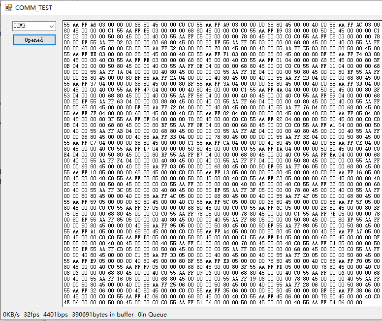
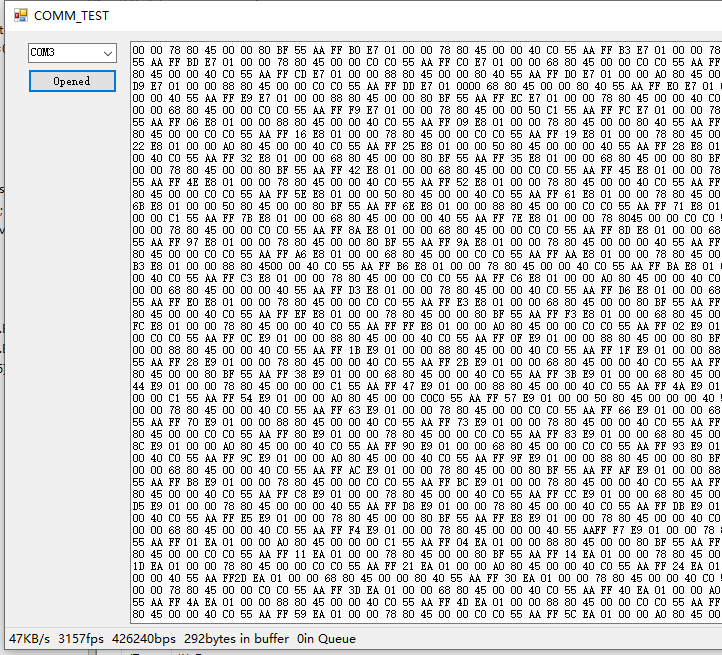
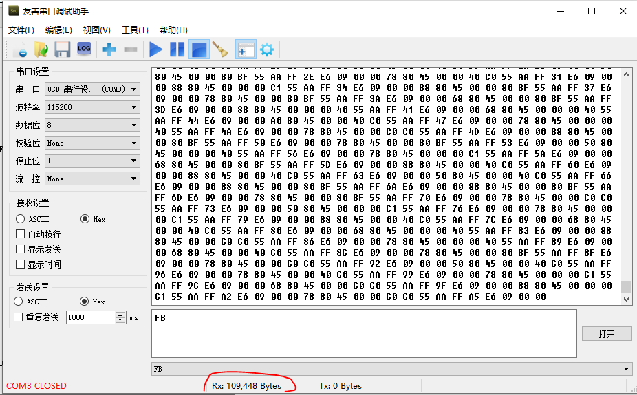
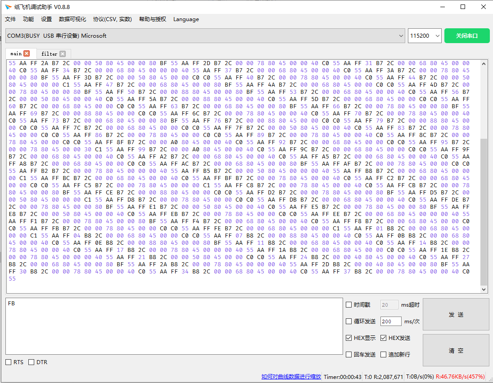
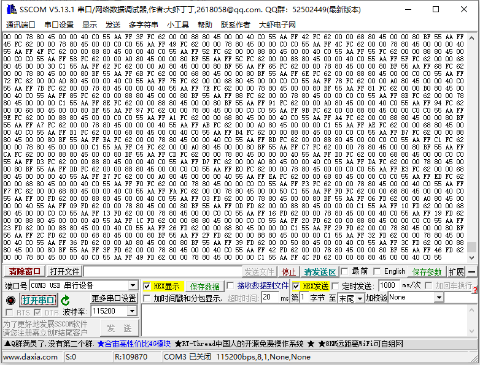
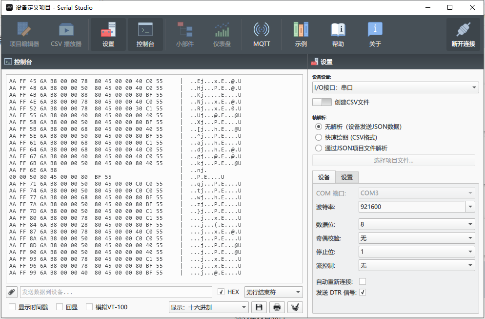
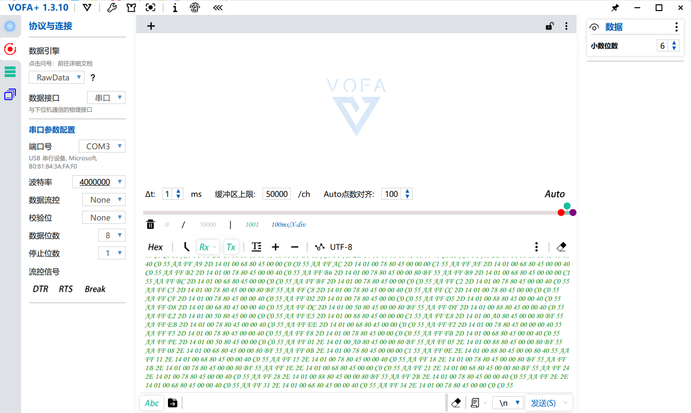

昨天测试串口助手，发现高速数据流对串口数据压力很大，经测试，压力主要来自windows的组件的接收字串并渲染的速度。

测试代码如下：

```csharp
            byte result;
            
            while(true)
            {

                while(serial.IsOpen && serial.BytesToRead>=0)
                {
                    byte_to_read=serial.BytesToRead;
                    result = (byte)serial.ReadByte();
                    rev_bytes_counter++;
                    rev_frame_counter=rev_bytes_counter/15;                
                }
                System.Threading.Thread.Sleep(1);
            }            
        }
```

现在是15个字节一个帧，结果如下：


现在接收速率是47KByte/s，3167帧/s，传输速率是427743bps，做到了实时接收，如果加一句显示的代码：

```csharp
                while(serial.IsOpen && serial.BytesToRead>=0)
                {
                    byte_to_read=serial.BytesToRead;
                    
                    result = (byte)serial.ReadByte();
                    rev_bytes_counter++;
                    textBox1.AppendText(result.ToString("X2")+" ");
                
                    rev_frame_counter=rev_bytes_counter/15;
                    
                }
```



速度立刻就炸了，每秒钟只能显示32个帧，然后大量的数据呆在串口缓冲区出不来，最后就boom……

后来我想，应该就是windows的textbox刷新太慢了，我一次写入大量数据，不就能缓解这个问题了？

改成如下代码：

```csharp
            byte[] toview = new byte[256];
            while(true)
            {

                while(serial.IsOpen && serial.BytesToRead>=256)
                {
                    byte_to_read=serial.BytesToRead;
                    serial.Read(toview,0,256);
                    textBox1.AppendText(BitConverter.ToString(toview).Replace("-"," "));
                    rev_bytes_counter+=256;                    
                    rev_frame_counter=rev_bytes_counter/15;
                    
                }
```

也就是一次往textbox里边扔256个字节，测试如下：



真是快了无数倍，基本达到了实时显示（当然，这代码的问题是小于256个字节就不显示，改起来很简单）。我开始好奇了……，这些常用的串口助手软件，究竟能做到什么程度呢？

先试试我常用的友善串口助手：



因为没有速度统计，我掐着表跑了10秒钟，收了100K左右，1秒10K，距离47K差的有点远。并且没有使用多线程，显示过程界面操作比较卡，总的来说是个不合格的助手。



纸飞机能跑到满速（但是没有上屏不好说，没源码，也有可能是先收到队列了，不过大概率是上了。因为分包比较明确，我每一帧最后的字符是0x55）牛逼。



SScom也是常用的助手，用了多线程，接收过程操作比较流畅，但是掐着表10秒钟也就100K左右，跟丁丁类似。



serial studio，也是没有速度显示，但是显示几秒钟后view界面就卡住了……，关了串口再打开又能显示几秒……



vofa，没有数据统计，但看起来显示挺快的，可能需要想另外的办法测试有没有全上屏。
