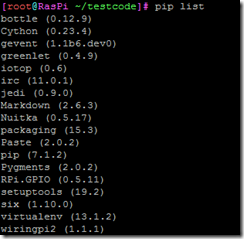

网上的教程，一般Python用RPi.GPIO来控制树莓派的GPIO，而C/C++一般用wringpi库来操作GPIO，RPi.GPIO过于简单，很多高级功能不支持，比如i2c/SPI库等，也缺乏高精度定时等高级特性。相比之下，wiringpi则功能丰富的多，其实wringpi已经有了python绑定，可以非常简单的在python中使用这个库。鉴于网上基本没有这个库的中文说明，我一边学习，一边以做笔记的形式，写几篇关于这个库的基本使用的文章。

安装：首先安装python-pip：

我用的Archlinux，python3，安装命令为：

```bash
pacman -S python-pip
```

如果用python2，安装命令为：

```bash
pacman -S python2-pip
```

Raspbian下则为：

```bash
apt-get install python3-pip
apt-get install python-pip
```

安装完后，就可以用pip install来安装python库了。为避免繁琐，我下边的命令都以pip命令安装，Archlinux下默认为python3的pip3，如果使用个python2则用pip2来代替pip，debian下pip默认为pip2，若使用python3，则使用pip3来代替。

```bash
pip install wiringpi2
```

pip库里除了wiringpi2外，还有老版本的wiringpi库，大家按需安装。

安装完后，运行pip list，可以看到列表中包含了新装的wringpi2库了：



在终端中敲入python，进入python控制台，导入一下，如果不报错，说明安装成功：


