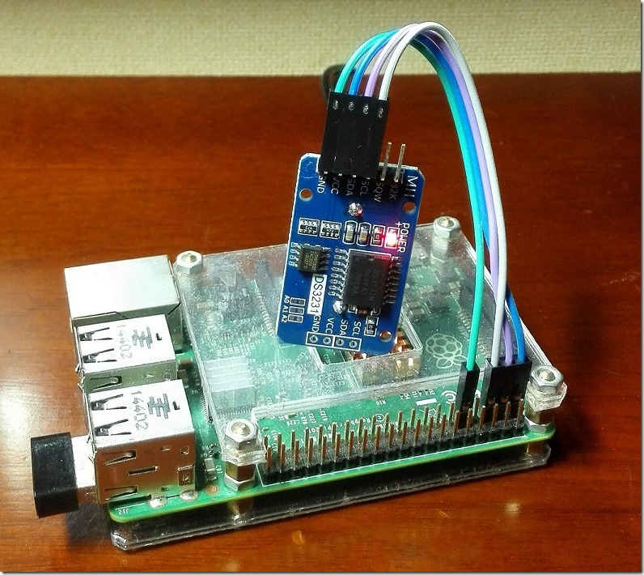
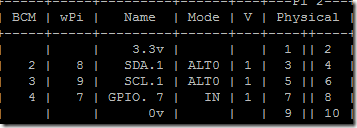
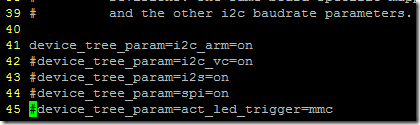
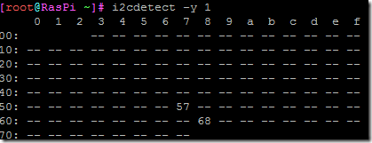
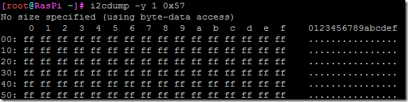
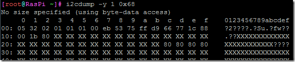
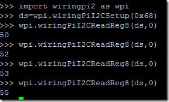
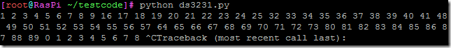
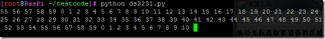

wiringpi2显然也把i2c驱动带给了Python，手头上正巧有一个DS3231的模块，上边带了一个DS3231 RTC（实时时钟），与一片24C32，两个芯片均为iic总线设备，与树莓派接线如下：





也就是VCC GND SDA SCL四个脚分别接到树莓派的1（3.3v）、9（0v）、3（SDA.1）、5（SCL.1）上，因为树莓派的I2C接口默认是关闭的，需要先编辑一下/boot/config.txt,去掉 device\_tree\_param=i2c\_arm=on上的注释（ArchlinuxARM RasperryPi2），然后重启（注：Raspbian可以用raspi-config打开）



然后重启，重启完成后，运行

```bash
modprobe i2c-dev
```

若想这个模块自动装载，请把它写到   /etc/modules-load.d/raspberrypi.conf

安装i2c-tools，Archlinux下为：

```bash
pacman –S i2c-tools
```

安装后，运行i2cdetect –y 1结果如下：



嗯，发现了57，68两个设备，哪个是DS3231，哪个又是24C32呢，我们把里边的数据dump出来看看：





可以看到0x57设备里边是空的，应该就是24C32了，0x68里边读出来20个字节，就是DS3231了。

我先解释下这几个命令：

i2cdetect顾名思义就是搜索i2c总线的设备，树莓派有2条i2c总线，咱们接的SDA.1,SCL.1，当然就是搜索1这条总线了（另外一条是SDA.0 SCL.0）

-y参数没啥意义，就是自己帮你按下y(yes).

i2cdump也很容易理解，就是dump出指定总线，指定设备的数据这里是1总线0x57 0x68两个设备。-y参数跟上个命令是一样的。

这样，我们的i2c设备就都通讯上了，下边就是用wiringpi2库读写之。

wringpi中操作i2c设备的函数主要有一下几个：

wiringPiI2CSetup() #这个函数的作用是初始化i2c设备，并返回一个设备对象（句柄），接下来，就是使用

wiringPiI2CRead()

wiringPiI2CReadReg16()

wiringPiI2CReadReg8()

wiringPiI2CWrite()

wiringPiI2CWriteReg16()

wiringPiI2CWriteReg8()

等函数来操作I2C总线设备了。

经过查阅DS3231的手册，DS3231的第一个寄存器值，读出的是秒，我们就读一下这个地址，代码比较简单，就直接在python shell里边写下来执行就行了代码如下“
  


可以看到，我们读出来了秒，我们把程序写进文件，一秒钟读一次：

```python
import wiringpi2 as wpi

ds=wpi.wiringPiI2CSetup(0x68)
while True:
    sec=wpi.wiringPiI2CReadReg8(ds,0)
    print(sec,end=' ',flush=True)
    wpi.delay(1000)
```

结果……



原来，这个RTC时钟读出来的是BCD码，比如9以后就是16，16的二进制为0001（1） 0000（0），4位一组，就是10，我编写了个小函数，把BCD码转换成10进制输出：

```python
import wiringpi2 as wpi

def b2s(bcd):
    return (bcd>>4)*10+(bcd&0xf) #高4位*10加上低四位

ds=wpi.wiringPiI2CSetup(0x68)
while True:
    sec=wpi.wiringPiI2CReadReg8(ds,0)
    print(b2s(sec),end=' ',flush=True)
    wpi.delay(1000)
```



呼呼终于正常了。
