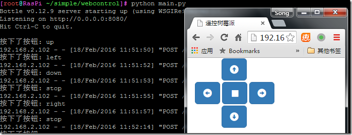
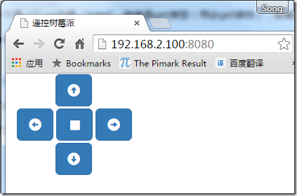

最终效果如图：



用到的知识：Python Bottle HTML Javascript JQuery Bootstrap AJAX 当然还有 linux

我去，这么多……我还是一点一点说起吧……

先贴最终的源代码：

```python
#!/usr/bin/env python3
from bottle import get,post,run,request,template

@get("/")
def index():
    return template("index")
@post("/cmd")
def cmd():
    print("按下了按钮: "+request.body.read().decode())
    return "OK"
run(host="0.0.0.0")
```

没错，就10句，我一句一句解释：

1.#!/usr/bin/env python3 ，告诉shell这个文件是Python源代码，让bash调用python3来解释这段代码

2.from bottle import get,post,run,request,template ，从bottle框架导入了我用到的方法、对象

下边几句是定义了2个路由，一个是“/”一个是“/cmd”,前者是get类型（用@get装饰），后者是POST类型（用的@post装饰）

第一个路由很简单，就是读取index模版（模版就是个html啦）并发送到客户端（浏览器），因为路径是“/”也就是比如树莓派的IP地址是：192.168.0.10

那用<http://192.168.0.10:8080>就访问到了我们的"/”路由（bottle默认端口是8080）

同理，第二个路由的路径是“/cmd”也就是访问<http://192.168.0.10:8080/cmd>就访问到了第二个路由

最后一句：run(host="0.0.0.0")就是调用bottle的run方法，建立一个http服务器，让我们能通过浏览器访问我们的界面。

下边我详细的解释一下这些代码的作用：

第一个路由的作用就是扔给浏览器一个HTML（index.tpl）文档，显示这个界面：



这个文件的源代码如下：

```html
<!DOCTYPE html>
<html lang="en">
<head>
    <meta charset="UTF-8">
    <meta name="viewport" content="width=device-width, initial-scale=1.0">
    <title>遥控树莓派</title>
    <link href="//cdn.bootcss.com/bootstrap/3.3.5/css/bootstrap.min.css" rel="stylesheet" media="screen">
    <script src="http://code.jquery.com/jquery.js"></script>
    <style type="text/css">
        #up {
            margin-left: 55px;
            margin-bottom: 3px;
        }
        #down {
            margin-top: 3px;
            margin-left: 55px;
        }
    </style>
    <script>
        $(function(){
            $("button").click(function(){
                $.post("/cmd",this.id,function(data,status){});
            });
        });

    </script>
</head>
<body>
<div id="container" class="container">
    <div>
        <button id="up" class="btn btn-lg btn-primary glyphicon glyphicon-circle-arrow-up"></button>
    </div>
    <div>
        <button id='left' class="btn btn-lg btn-primary glyphicon glyphicon-circle-arrow-left"></button>
        <button id='stop' class="btn btn-lg btn-primary glyphicon glyphicon-stop"></button>
        <button id='right' class="btn btn-lg btn-primary glyphicon glyphicon-circle-arrow-right"></button>
    </div>
    <div>
        <button id='down' class="btn btn-lg btn-primary glyphicon glyphicon-circle-arrow-down"></button>
    </div>

</div>

<script src="//cdn.bootcss.com/bootstrap/3.3.5/js/bootstrap.min.js"></script>
</body>
</html>
```

这个内容有点多，不过很简单，就是引用了jquery bootstrap这两个前端框架，加了5个按钮(<body></body>之间的代码)。当然我用了bootstrap内置的上下左右停止这几个图标，这5个按钮的id分辨定义成up，down，left，right，stop，然后写了如下的关键代码：

```javascript
$(function(){
            $("button").click(function(){
                $.post("/cmd",this.id,function(data,status){});
            });
        });
```

没错，就这三句代码……

第1，2行给所有的按钮（button）绑定了一个点击的事件，第三行调用jquery的post方法把this.id(被单击按钮的id)，发送到“/cmd”这个路径下，这时，我们python代码的第二个路由起作用了，接收到了网页上被单击按钮的id，并打印出了“按下了按钮： XXX”

当然，在这里写几个if语句判断，就可以按照实际的需求做一些实际的控制了，嗯，比如调用wiringpi2 for python控制树莓派的GPIO。

完整的源代码如下（自带了bottle框架，解压后直接运行就好）

http://pan.baidu.com/s/1qWYPHQs

post by yafeng

