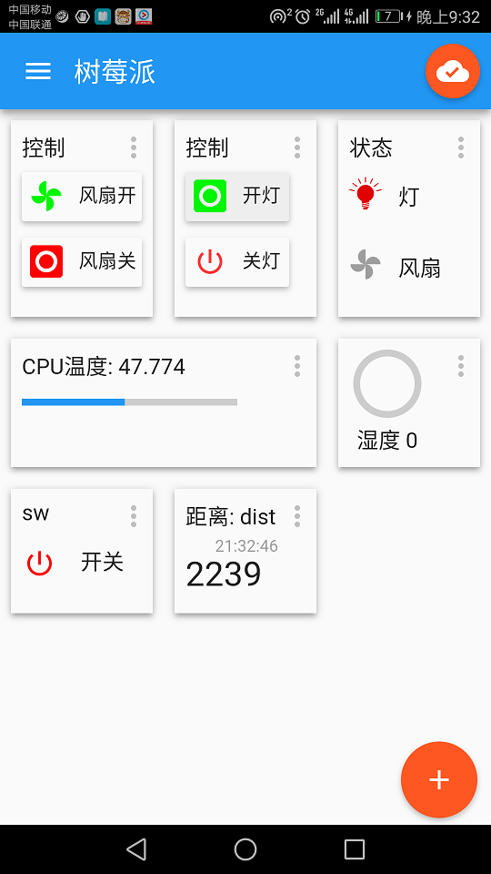
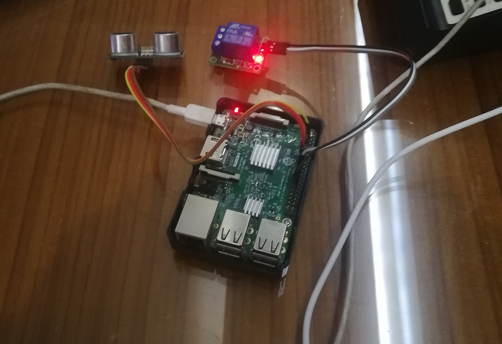

其实你被标题党骗了，0编程那是不可能的(￣▽￣)"

不过也算近似零编程了哈哈

MQTT我就不详细介绍了，毕竟看到这个标题进来的一般也就有些基础知识了。简单说说：

MQTT是IBM发布的一个物联网协议，怎么说呢，微信大家都知道，微信是大家互相联系用的，MQTT其实就类似一个物联网的微信，各个设备间可以通过MQTT来沟通信息。

其实设备间联系的协议有很多，比如TCP/UDP，HTTP等。MQTT作为很晚才出现的后辈，当然是解决以前协议的痛点的。

1.TCP/UDP（SOCKET通讯）这个是物联网甚至是互联网的基础。在应用层面，这算底层了，优点当然是灵活，其实灵活，往往就意味着难用（比如C++就很灵活）你如果想开发一个基于TCP通讯，你需要考虑通讯的方方面面，比如断线重连，比如心跳包，比如加密传输，这些都得自己来实现，可能会占用你大量的调优时间。

2.HTTP，HTTP协议大家都知道是网页传输协议，其实网页传输是HTTP的一种应用而已，HTTP属于对TCP的高层封装，是一种短链接协议，可用于设备间连接。基于HTTP协议的连接方式又有个名字叫RESTful，这个编程就简单了，因为短链接么，就不用考虑啥断线重连之类的了，并且python有urllib，requsets等库，通讯就是一句代码的事，简单至极，但也有缺点:包头太长，每次通讯都要重新连接一次。如果几秒或者几分钟以上通讯一次还差不多，如果太过频繁，不但浪费资源，也太占带宽。

MQTT完美解决了上边这些协议的痛点，并且由于是个标准，现在各种语言，乃至安卓、IOS上都有现成的客户端，特别适合我这种懒得开发JAVA APP的懒人。这里介绍一个好用的安卓APP：ioT MQTT Panel，装了这个APP，设置一下，就能通过MQTT控制设备了，下边是我随便做了个界面：

怎么样？是不是有点意思，值得说的是: 这是完全不需要编写代码的装上这个APP，设置一下就可以了，嗯这是跟我的树莓派连接的：

树莓派上我接了一个继电器，一个超声波测距仪，手机客户端则是实时显示树莓派CPU温度、超声波测距的距离，以及控制继电器吸合、断开。

下一篇，我会实战介绍下用这个APP控制ESP8266（nodemcu）来实现无线控制LED灯的亮灭。
