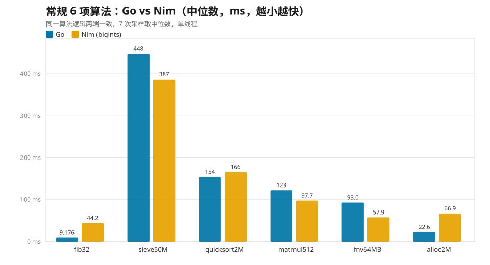
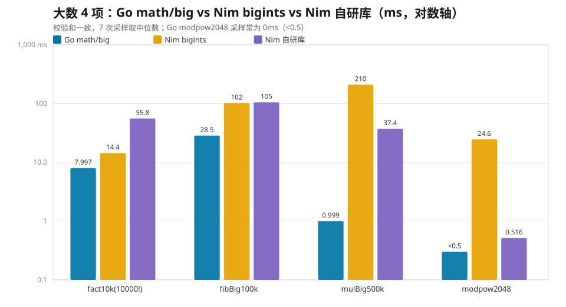
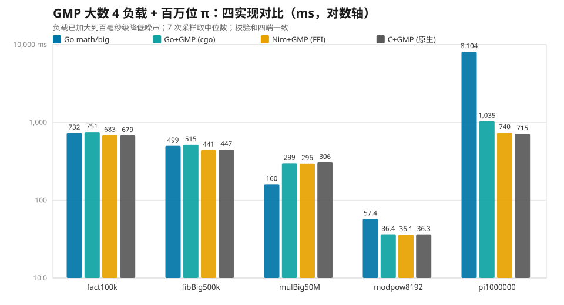
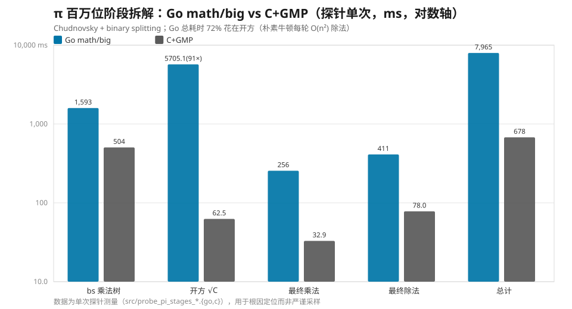
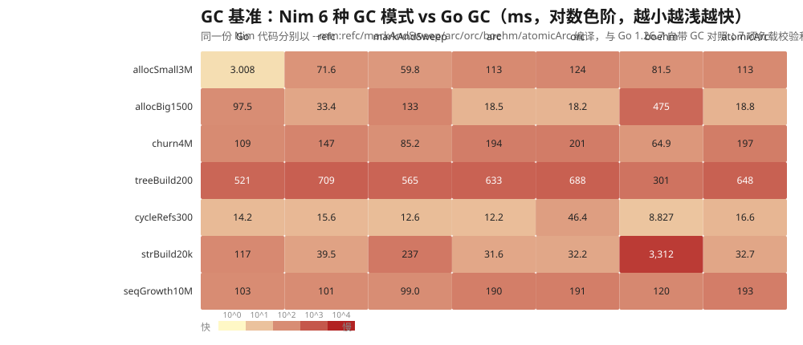

Nim 一直有个卖点：编译到 C、号称性能接近 C 但写起来像 Python。而 Go 以工程化著称，性能在同代语言里也不差。两者到底差多少？与其看网上各说各话，不如在自己机器上跑一遍。

这篇文章记录了一次比较完整的对比测试：**10 项常规 + 大数算法、GMP 四端 FFI、百万位 π 根因拆解、6 种 Nim GC vs Go GC**，共五轮。所有负载两端输出**相同的校验和**（保证做的是同样的工作量），7 次采样取中位数，单线程。

## TL;DR

- **常规算法两端半斤八两**：6 项合计 Go 849.7 ms vs Nim 819.6 ms（Nim 快约 3.5%）。Go 在递归调用和小对象分配上大幅领先，Nim 在素数筛、矩阵乘法、哈希上更快。
- **大数运算 Go `math/big` 全面碾压**：4 项全部领先，Nim 生态库 `bigints` 落后 1.8~210 倍。但用自研的 Karatsuba/Toom-3 大数库可以在生态内把乘法类负载提升一个数量级（模幂快 48×）——**算法复杂度比语言本身更值钱**。
- **FFI 不是问题，问题在调用频率**：Nim 手写 GMP 绑定 FFI 开销≈0~3.5%；Go cgo 单次大调用与 C 等价，但在百万次跨界小调用场景慢 45%。
- **Go `math/big` 输得最惨的地方是除法与开方**：百万位 π 比 GMP 慢 7.8~11.3 倍，其中开方段就占了 Go 总耗时的 72%（朴素牛顿迭代，每轮一次 O(n²) 大除法）。
- **GC 没有绝对赢家**：Go 的高频小对象分配快得离谱（比 Nim 最快的 arc 快约 38 倍），但大对象、字符串构建、指针结构场景各有不同的最优解。

## 测试环境与方法

| 项目 | 配置 |
| --- | --- |
| CPU / 系统 | Intel i9-11950H @ 2.60GHz（8C16T），Windows 10 企业版 LTSC |
| Go | 1.26.7，`go build` 默认优化 |
| Nim | 2.2.12（ORC），`nim c -d:release --opt:speed --passC:-O3 --passL:-O3` |
| 大数库 | Go `math/big`；Nim 生态包 `bigints` 1.1.0；Nim 自研库（见下文） |
| GMP | MSYS2 `libgmp-10.dll`，C 端 `gcc -O3 -lgmp` |
| 采样 | 每项 7 次采样取中位数，单线程（Go 侧 `GOMAXPROCS=1`） |

方法学上只有一条硬规矩：**每项负载两端必须输出一致的校验和**。校验和统一为「bitlen × 10⁶ + 末 6 位」，只有两端算出的数完全一样，比出来的时间差才有意义。

## 第一轮：常规 6 项算法（两端同一实现）

6 项负载覆盖了函数调用、整数运算、内存写入、随机访问、浮点与内存带宽，算法逻辑两端完全一致：

| 基准 | 负载特征 | Go (ms) | Nim (ms) | Nim/Go | 更快 |
| --- | --- | ---: | ---: | ---: | --- |
| fib32 | 递归函数调用 | 9.2 | 44.3 | 4.82 | Go（快约 3.8 倍） |
| sieve50M | 整数运算 + 内存写入 | 448.1 | 386.9 | 0.86 | Nim（快约 14%） |
| quicksort2M | 随机访问 + 递归 | 154.2 | 165.9 | 1.08 | Go（快约 8%） |
| matmul512 | 浮点运算（i-k-j 循环） | 122.6 | 97.7 | 0.80 | Nim（快约 20%） |
| fnv64MB | 字节处理 / 内存带宽 | 93.0 | 57.9 | 0.62 | Nim（快约 38%） |
| alloc2M | 小对象分配（GC vs ORC） | 22.6 | 66.9 | 2.96 | Go（快约 3 倍） |



几个有意思的点：

- **fib32** 的差距（4.8×）是「慢在递归」的典型：Nim 默认 ORC 下函数调用与栈管理成本更高，Go 的栈增长式调用更便宜。这个负载也是整轮测试里单点差距最大的常规项。
- **sieve50M / fnv64MB / matmul512** 都是「计算密集、无 GC 干扰」的类型，Nim 编译到 C 后可以放开手脚优化，快 14%~38%。尤其是 FNV 哈希，几乎贴着内存带宽在跑。
- **alloc2M** 是唯一体现 GC 差异的常规项：Go 的 GC 对小对象批量分配非常友好（后面 GC 轮会更夸张）。

6 项合计：**Go 849.7 ms vs Nim 819.6 ms，Nim 快约 3.5%**——常规负载下两者基本打平。

## 第二轮：大数运算（Go math/big vs Nim bigints vs Nim 自研库）

常规算法打平，但大数运算是另一个世界。这里对比三个实现：Go 标准库 `math/big`、Nim 生态库 `bigints`，以及**用 Nim 自研的深度优化大数库**（2 的幂 limb + Karatsuba/Toom-3 乘法 + Knuth 长除法）：

| 基准 | 说明 | Go (ms) | bigints (ms) | 自研库 (ms) | 更快 |
| --- | --- | ---: | ---: | ---: | --- |
| fact10k | 10000!（结果约 3.6 万位） | 8.0 | 14.4 | 55.8 | Go |
| fibBig100k | fib(100000)（约 2.1 万位） | 28.5 | 102.0 | 105.3 | Go |
| mulBig500k | 两个 40~50 万位大数相乘 | 1.0 | 210.3 | 37.4 | Go |
| modpow2048 | 2048 位模数模幂（RSA 风格） | <0.5 | 24.6 | 0.5 | Go |



结论有三层：

1. **Go `math/big` 四项全胜**，自研库相对它慢 3.7~37 倍（模幂差距更大）。Go 的 math/big 经过多年打磨：原生 limb 原语、更细的算法阈值、更少的分配，这些都不是一个周末能追上的。
2. **但自研库 vs 生态库 `bigints` 是数量级碾压**：`mulBig500k` 快 5.6×（210→37 ms）、`modpow2048` 快 48×（24.6→0.5 ms）、`fibBig100k` 持平；只有 `fact10k` 慢 3.9×——阶乘是「小整数 × 大数」的链式乘法，瓶颈在逐次分配与朴素乘法常数，bigints 对此有更省的分支。
3. **把乘法从 O(n²) 提升到 Karatsuba/Toom-3、除法用 Knuth 长除法，可以在同一生态内带来数量级提升**（模幂 48×）。这印证了一个老观点：对超大数，**算法复杂度 > 编译器 > 语言本身**。

自研库的设计要点（`src/nim_bigint.nim`）：小端序 `seq[uint32]`、base 2³² 的 2 幂 limb；乘法三档分派（朴素 O(n²) → Karatsuba ≥24 limbs → Toom-3 ≥192 limbs）；除法用 Knuth Algorithm D（64 位试商 + 乘减 + 下溢纠正）；另有 `modpow` 平方-乘、`mod1e6` 校验和、十进制转换等。正确性通过 400 组随机小规模 + 16 组大乘（覆盖 Karatsuba/Toom-3）+ 20 组长除法 + 特殊形态，全部对照 `bigints` 通过。

10 项合计：**Go 887 ms vs Nim(bigints) 1171 ms vs Nim(自研大数 + bigints 常规) 1019 ms**。常规打平，大数拉开差距。

## 第三轮：GMP 四端对比（把生态库换成 GMP 之后）

生态库拉胯，那直接上 GMP 呢？补充一轮四端对比：Go `math/big`、Go 经 cgo 调 GMP、Nim 手写 dynlib FFI 绑 GMP（Nim 2.2 已移除 std/gmp）、C 原生链接 GMP（零 FFI 开销参照线）。负载加大到百毫秒级以降低噪声：

| 基准 | Go math/big | Go+GMP (cgo) | Nim+GMP (FFI) | C+GMP (原生) | 说明 |
| --- | ---: | ---: | ---: | ---: | --- |
| fact100k（100000!，约 45.7 万位） | 731.69 | 751.27 | 682.91 | **678.51** | C ≈ FFI；cgo 慢约 11% |
| fibBig500k（fib(500000)） | 498.86 | 515.44 | **440.76** | 447.17 | math/big 慢约 13% |
| mulBig50M（(2⁵⁰⁰⁰万-1)×(2⁴⁰⁰⁰万-1)） | **159.91** | 298.60 | 296.08 | 305.73 | math/big 快约 1.9× |
| modpow8192（3^(2³⁰⁰⁰) mod 2⁸¹⁹²-159） | 57.42 | 36.42 | **36.12** | 36.31 | GMP 快约 58% |
| pi1000000（100 万位 π，Chudnovsky+BS） | 8104.29 | 1034.78 | 740.49 | **715.50** | GMP 快 7.8~11.3× |



四个结论，越往后越反直觉：

1. **Nim FFI 开销 ≈ 0~3.5%**。手写 dynlib 绑定 + 裸调用，每次跨界调用约 10~25 ns，单次大负载场景（fact/fib/modpow）与 C 几乎等价。**“FFI 慢”这个刻板印象，在 Nim 上不成立。**
2. **cgo 在“跨界小调用密集”场景最贵**：π 的 binary-splitting 树有约 100 万次跨界小调用，cgo 慢 45%；链式大调用（fact/fib）慢 11~15%。单次大负载调用 cgo 与 C 等价（modpow 只差 0.3%）。
3. **纯乘法反而是 math/big 快 1.9×**：Go 1.22+ 的 math/big 内置 FFT（阈值低），本机 MSYS2 的 GMP 构建较旧、FFT 调度偏保守。补充探针也印证：200 万位乘法 math/big 2.76 vs GMP 6.35 ms、1000 万位 22.86 vs 38.93 ms（快 1.7~2.2×）。
4. **但 RSA/模幂 GMP 的 powm（Montgomery + 滑动窗口）优势显著**：8192 位下快约 58%（4096 位时只有 19%，差距随规模放大）。而 π 这种「除法/开方密集」的负载，GMP 直接快 7.8~11.3×。

## 第四轮：百万位 π 的根因拆解（为什么 math/big 大输）

π 的差距不是整体性的，而是**结构性**的。把 π 计算（Chudnovsky + binary splitting）切成 4 段分别计时：

| 阶段 | Go math/big | C+GMP | 倍率 |
| --- | ---: | ---: | ---: |
| bs 乘法树 | 1593.0 | 504.5 | 3.2× |
| 开方（10^(2e6)×10005） | **5705.1** | 62.5 | **91×** |
| 最终乘法（Q×426880×√C） | 255.5 | 32.9 | 7.8× |
| 最终除法（num/T） | 411.2 | 78.0 | 5.3× |
| **总计** | **7964.9** | 677.9 | **11.7×** |



根因非常明确：

- **开方段占 Go 总耗时的 72%**。Go 的 `Int.Sqrt` 是朴素牛顿迭代 `z ← ⌊(z + ⌊x/z⌋)/2⌋`——**每一轮都是一次 O(n²) 的 Knuth 大除法**。初值 `2^⌈(n+1)/2⌉` 与 √x 差约 20%（radicand 的 bitlen 恰为偶数 6643870），平方收敛到 1 ulp 需要 log₂(bitlen) ≈ 22 轮（实测 (z₁²-x) 的位长每轮减半）。而 GMP 的 `mpz_sqrt` 内部用 `mpn_sqrtrem` 近似算法，主循环是乘加、无大除法，只花 62.5 ms。
- 最终除法 5.3×：math/big 除法没有 subquadratic 算法，GMP 用 DBL/牛顿。
- bs 乘法树 3.2×：大量中规模乘法调度 + Go 节点分配触发 GC。
- 反过来说，**单次 100 万位乘法 Go 反而快（16.3 vs 20.8 ms）——math/big 输在除法与开方，不在乘法**。

## 第五轮：GC 基准（Nim 6 种 GC 模式 vs Go GC）

最后一轮专门测 GC。同一份 Nim 基准代码分别以 `--mm:refc / markAndSweep / arc / orc / boehm / atomicArc` 编译（`--mm:go` 本机缺 libgo.dll 不可运行、`--mm:none` 无 GC 不可比），与 Go 1.26.7 自带 GC 对照。7 项负载覆盖小/大对象分配、分配-释放交替、二叉树、循环引用、字符串构建、seq 增长；7 个实现校验和完全一致。



| 基准 | Go | refc | mark&sweep | arc | orc | boehm | atomicArc |
| --- | ---: | ---: | ---: | ---: | ---: | ---: | ---: |
| allocSmall3M（300 万小对象） | **3.0** | 71.6 | 59.8 | 113.2 | 124.0 | 81.5 | 113.4 |
| allocBig1500（1500 个 1 MiB） | 97.5 | 33.4 | 132.6 | 18.5 | **18.3** | 475.5 | 18.8 |
| churn4M（400 万分配-释放） | 108.8 | 147.1 | 85.2 | 194.0 | 200.9 | **64.9** | 196.8 |
| treeBuild200（200 棵满二叉树） | 521.4 | 709.1 | 564.7 | 632.8 | 688.0 | **301.1** | 647.7 |
| cycleRefs300（300 个循环链表） | 14.2 | 15.6 | 12.6 | 12.2* | 46.4 | **8.8** | 16.6 |
| strBuild20k（2 万次字符串拼接） | 117.3 | 39.5 | 237.2 | **31.6** | 32.2 | 3311.7 | 32.7 |
| seqGrowth10M（1000 万次 push） | 102.6 | 100.7 | **99.0** | 189.7 | 190.6 | 120.2 | 193.0 |
| **7 项合计** | **965** | 1117 | 1191 | 1192 | 1300 | 4364 | 1219 |

\* arc 不回收循环引用，cycleRefs 的“快”是以内存泄漏为代价；orc 有循环收集器（比 arc 慢 3.8×），追踪式全部正常回收。

读这张表的关键是：**没有绝对赢家**。7 项负载的“最快”分布在 5 个实现上：

- **追踪式（refc / m&s / boehm / Go）**：分配便宜、回收周期性；**引用计数（arc/orc/atomicArc）**：每对象即时增减引用并释放，短生命周期对象反而更贵。
- **高频小对象分配**：Go 3.0 ms 遥遥领先（比 arc 快约 38×）。在 Nim 里避免用 arc/orc 做小对象流水。
- **大对象 / 字符串构建**：arc/orc/atomicArc 最快（18 / 32 ms）；boehm 是灾难（475 / 3312 ms，字符串拼接被慢到离谱）。
- **指针结构（树、循环、交替释放）**：boehm 三项全场第一（301 / 8.8 / 64.9 ms），Go 次之。
- **seq 增长**：refc / m&s / Go ≈ 99~103 ms；arc 系约 190 ms（扩容需搬移并维护引用计数）。

按负载选型的一句话总结：**高频小对象 → Go/refc；大块内存与字符串流 → arc/orc；大量指针结构 → boehm/Go；循环引用 → Go/orc/refc（arc 泄漏勿用）；seq 频繁增长 → m&s/Go；综合均衡 → orc（Nim 2.x 默认）**。

## 总结与选型建议

把五轮测试放一起，可以给出相当务实的结论：

| 场景 | 推荐 | 理由 |
| --- | --- | --- |
| 常规计算密集算法 | Nim / Go 皆可 | 6 项合计仅差 3.5%，按生态选 |
| 高频小对象分配 | **Go** | 比 Nim 最快方案还快一个数量级 |
| 大数乘法/模幂（自己写） | **Go math/big** | 深度优化碾压生态库；Nim 需自研算法级优化才能接近 |
| 大数模幂（可引 GMP） | Nim+GMP FFI / C | FFI 开销≈0，GMP powm 快 58% |
| 除法/开方密集（π 类） | **GMP** | 比 math/big 快 7.8~11.3×，开方段 91× |
| 高性能 FFI 调用 | Nim dynlib | cgo 在百万次小调用场景慢 45% |
| 默认 GC 选择 | Nim 用 orc；高频小对象换 refc | 无全局最优 |

一句话总结：**常规负载 Go 与 Nim 打平；一旦进入大数、FFI 调用模式、GC 形态这些“深水区”，差距就不是语言本身的锅，而是运行库与算法选择的锅**——Go 的 math/big 和 GC 打磨得深，Nim 的 ARC/FFI 和 C 后端也有自己的主场。

## 局限说明

- 单机单测：i9-11950H + Windows 10，其他平台/版本结果可能不同。
- 单线程对比，未测多核、并发与内存峰值。
- π 的阶段拆解是探针单次测量，用于根因定位而非严谨采样。
- Nim 侧常规项默认 ORC；换 `--mm:refc` 等模式常规项结果会变（GC 轮已展示差异幅度）。

## 复现

测试工程位于本机 `benchmark/nimgolang`（源码、脚本、CSV、可视化报告齐全），一键复现：

```powershell
# 常规 10 项 + 大数（需先 nimble install -y bigints）
powershell -ExecutionPolicy Bypass -File run_benchmark.ps1 -Runs 7

# GC 基准（Go + Nim 6 种 --mm）
powershell -ExecutionPolicy Bypass -File run_gc_benchmark.ps1 -Runs 7

# GMP 四端大数
powershell -ExecutionPolicy Bypass -File run_gmp_benchmark.ps1 -Runs 7

# 百万位 π
powershell -ExecutionPolicy Bypass -File run_pi_benchmark.ps1 -Runs 7
```

每个脚本会自动：编译 → 各运行 N 次 → 校验三端/四端校验和一致 → 计算中位数 → 输出 CSV 与汇总表，并生成浏览器可直接打开的可视化报告（`results/*_report.html`）。
