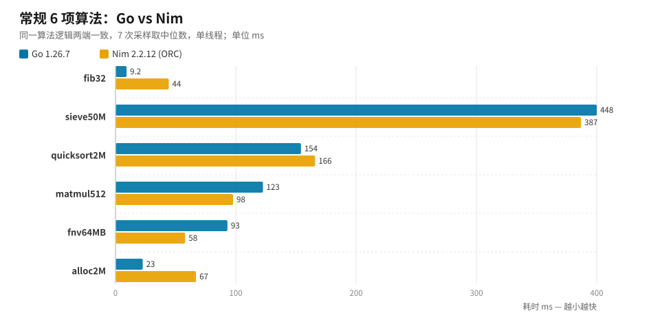

> **系列文章**
> **（一）6 项常规算法对决**（本篇） ·
> [（二）大数运算与 GMP 四端对比](/programming-misc/go-vs-nim-bigint/) ·
> [（三）6 种 GC 模式全景对比](/programming-misc/go-vs-nim-gc/)

Nim 一直有个卖点：编译到 C、号称性能接近 C 但写起来像 Python。Go 则以工程化著称，在同代语言里性能也不差。两者到底差多少？与其看网上各说各话，不如在自己机器上跑一遍。

这次对比一共五轮测试：**6 项常规算法、大数运算、GMP 四端 FFI、百万位 π 根因拆解、6 种 GC 模式**。考虑到内容量，拆成三篇发布：本篇是**常规算法**（也是整个系列的方法学基础），第二篇讲大数与 GMP，第三篇讲 GC。

所有负载两端都输出**相同的校验和**（保证做的是同样的工作量），7 次采样取中位数，单线程。

## 测试环境与方法

| 项目 | 配置 |
| --- | --- |
| CPU / 系统 | Intel i9-11950H @ 2.60GHz（8C16T），Windows 10 企业版 LTSC |
| Go | 1.26.7，`go build` 默认优化 |
| Nim | 2.2.12（ORC），`nim c -d:release --opt:speed --passC:-O3 --passL:-O3` |
| 采样 | 每项 7 次采样取中位数，单线程（Go 侧 `GOMAXPROCS=1`） |

方法学上只有一条硬规矩：**每项负载两端必须输出一致的校验和**。校验和统一为「bitlen × 10⁶ + 末 6 位」——只有两端算出的数完全一样，比出来的时间差才有意义。

## 6 项常规算法：两端同一实现

6 项负载覆盖了函数调用、整数运算、内存写入、随机访问、浮点与内存带宽，算法逻辑两端完全一致：

| 基准 | 负载特征 | Go (ms) | Nim (ms) | Nim/Go | 更快 |
| --- | --- | --- | ---: | ---: | --- |
| fib32 | 递归函数调用 | 9.2 | 44.3 | 4.82 | Go（快约 3.8 倍） |
| sieve50M | 整数运算 + 内存写入 | 448.1 | 386.9 | 0.86 | Nim（快约 14%） |
| quicksort2M | 随机访问 + 递归 | 154.2 | 165.9 | 1.08 | Go（快约 8%） |
| matmul512 | 浮点运算（i-k-j 循环） | 122.6 | 97.7 | 0.80 | Nim（快约 20%） |
| fnv64MB | 字节处理 / 内存带宽 | 93.0 | 57.9 | 0.62 | Nim（快约 38%） |
| alloc2M | 小对象分配（GC vs ORC） | 22.6 | 66.9 | 2.96 | Go（快约 3 倍） |



## 逐项拆解

**fib32：慢在递归（4.8×，全场单点差距最大）**
Nim 默认 ORC 下函数调用与栈管理成本更高，Go 的栈增长式调用更便宜。这是典型的「调用密集型」负载，也是整轮测试里差距最大的常规项。

**sieve50M / fnv64MB / matmul512：Nim 快 14%~38%**
这三项都是「计算密集、无 GC 干扰」的类型，Nim 编译到 C 后可以放开手脚优化。尤其是 FNV 哈希，几乎贴着内存带宽在跑，Nim 快 38%。

**quicksort2M：Go 快 8%**
随机访问 + 递归，两端各有胜负区间，差距不大。

**alloc2M：唯一体现 GC 差异的常规项**
Go 的 GC 对小对象批量分配非常友好，快约 3 倍。第三篇的 GC 轮会把这个差距放到更极端的场景里看。

## 本篇结论

**6 项合计：Go 849.7 ms vs Nim 819.6 ms，Nim 快约 3.5%——常规负载下两者基本打平。**

更有价值的是分项结论：Go 赢在**递归调用与高频小对象分配**，Nim 赢在**纯计算密集的整数、浮点与内存带宽型负载**。所以常规业务代码里，选型更应该看生态和团队熟悉度，而不是这 3.5% 的差距。

但要提醒一句：**「打平」只成立于常规负载**。一旦进入大数运算、FFI 调用、GC 形态这些深水区，差距会拉开到数量级——见第二篇和第三篇。

## 复现

测试工程位于本机 `benchmark/nimgolang`（源码、脚本、CSV、可视化报告齐全）：

```powershell
# 常规 10 项 + 大数（需先 nimble install -y bigints）
powershell -ExecutionPolicy Bypass -File run_benchmark.ps1 -Runs 7
```

脚本会自动：编译 → 各运行 N 次 → 校验两端校验和一致 → 计算中位数 → 输出 CSV 与汇总表，并生成浏览器可直接打开的可视化报告（`results/*_report.html`）。

## 局限说明

- 单机单测：i9-11950H + Windows 10，其他平台/版本结果可能不同。
- 单线程对比，未测多核、并发与内存峰值。
- Nim 侧常规项默认 ORC；换 `--mm:refc` 等模式结果会变（第三篇展示了差异幅度）。

---

**下一篇**：[（二）大数运算与 GMP 四端对比](/programming-misc/go-vs-nim-bigint/)——常规打平，但大数是另一个世界：Go `math/big` 四项全胜，Nim 生态库落后最多 210 倍。
