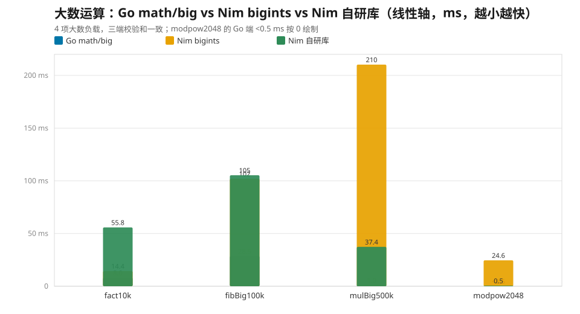
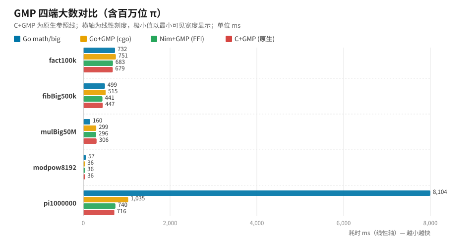
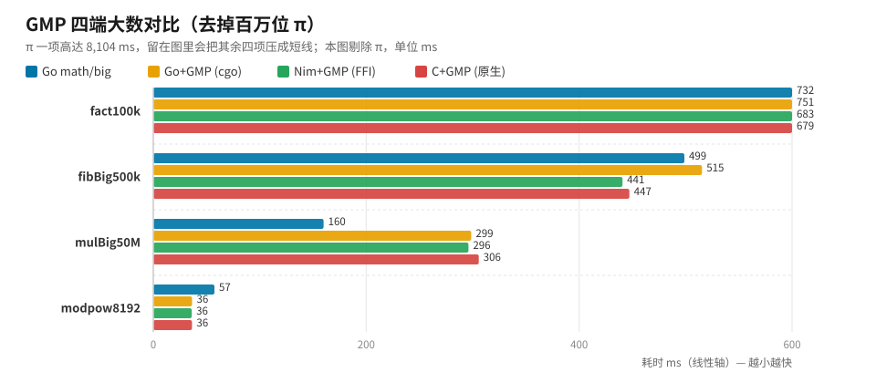
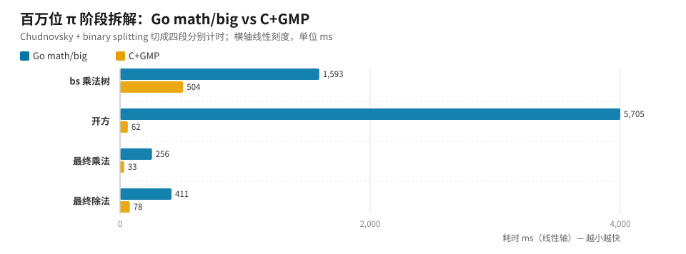

> **系列导航**
> [（一）6 项常规算法对决](/programming-misc/go-vs-nim-algorithms/)
> **（二）大数运算与 GMP 四端**（本篇）
> [（三）6 种 GC 模式全景对比](/programming-misc/go-vs-nim-gc/)

[上一篇](/programming-misc/go-vs-nim-algorithms/)的结论是：常规负载下 Go 与 Nim 基本打平（6 项合计差 3.5%）。但大数运算完全是另一个世界——差距会从百分之几拉到**数量级**。

本篇覆盖三轮测试：**大数运算三实现对比 → GMP 四端 FFI → 百万位 π 根因拆解**。环境、校验和规则与上一篇相同，不再重复。


- **Go `math/big` 四项全胜**。Nim 生态库 `bigints` 最多落后 210 倍。
- **但差距主要来自算法而非语言**：换成自研 Karatsuba/Toom-3 库后，模幂快 48 倍——同一生态内的数量级提升。
- **Nim 的 GMP FFI 开销 ≈ 0**（10~25 ns/次），而 Go 的 **cgo 在百万次跨界小调用场景慢 45%**。
- **math/big 真正输的是除法与开方**，不是乘法：百万位 π 里开方一段就占 Go 总耗时 72%，比 GMP 慢 91 倍。


## 一、大数运算：三实现对比

对比三个实现：Go 标准库 `math/big`、Nim 生态库 `bigints`、以及**用 Nim 自研的深度优化大数库**（2 的幂 limb + Karatsuba/Toom-3 乘法 + Knuth 长除法）：

| 基准 | 说明 | Go math/big (ms) | Nim bigints (ms) | Nim 自研库 (ms) |
| --- | --- | ---: | ---: | ---: |
| fact10k | 10000!（约 3.6 万位） | **8.0** | 14.4 | 55.8 |
| fibBig100k | fib(100000)（约 2.1 万位） | **28.5** | 102.0 | 105.3 |
| mulBig500k | 两个 40~50 万位大数相乘 | **1.0** | 210.3 | 37.4 |
| modpow2048 | 2048 位模幂（RSA 风格） | **<0.5** | 24.6 | 0.5 |

> 注：`modpow2048` 的 Go 结果低于计时分辨率，按 0.5 ms 作图。



三层结论：

**1. Go `math/big` 四项全胜**，自研库相对它慢 3.7~37 倍。`math/big` 经过多年打磨：原生 limb 原语、更细的算法阈值、更少的分配，这些都不是一个周末能追平的。

**2. 但自研库对生态库是数量级碾压**：`mulBig500k` 快 5.6×（210 → 37 ms）、`modpow2048` 快 48×（24.6 → 0.5 ms）、`fibBig100k` 持平；只有 `fact10k` 慢 3.9×——阶乘是「小整数 × 大数」的链式乘法，瓶颈在逐次分配与朴素乘法常数，`bigints` 对此有更省的分支。

**3. 把乘法从 O(n²) 换成 Karatsuba/Toom-3、除法换成 Knuth 长除法，能在同一语言生态内带来数量级提升**。对超大数，**算法复杂度 > 编译器 > 语言本身**。

自研库设计要点（`src/nim_bigint.nim`）：小端序 `seq[uint32]`、base 2³² 的 2 幂 limb；乘法三档分派（朴素 O(n²) → Karatsuba ≥ 24 limbs → Toom-3 ≥ 192 limbs）；除法用 Knuth Algorithm D（64 位试商 + 乘减 + 下溢纠正）；另有 `modpow` 平方-乘、`mod1e6` 校验和、十进制转换。正确性通过 400 组随机小规模 + 16 组大乘（覆盖 Karatsuba/Toom-3）+ 20 组长除法 + 特殊形态，全部对照 `bigints` 通过。

连同常规 6 项，10 项合计：**Go 887 ms vs Nim(bigints) 1171 ms vs Nim(自研大数 + bigints 常规) 1019 ms**。常规项打平，大数项拉开差距。

## 二、GMP 四端对比

生态库拉胯，那直接上 GMP 呢？这一轮四端对比：**Go `math/big`、Go 经 cgo 调 GMP、Nim 手写 dynlib FFI 绑 GMP**（Nim 2.2 已移除 `std/gmp`）、**C 原生链接 GMP**（零 FFI 开销的参照线）。负载加大到百毫秒级以降低噪声：

| 基准 | Go math/big | Go+GMP (cgo) | Nim+GMP (FFI) | C+GMP (原生) |
| --- | ---: | ---: | ---: | ---: |
| fact100k（100000!，约 45.7 万位） | 731.69 | 751.27 | 682.91 | **678.51** |
| fibBig500k（fib(500000)） | 498.86 | 515.44 | **440.76** | 447.17 |
| mulBig50M（(2⁵⁰⁰⁰万-1)×(2⁴⁰⁰⁰万-1)） | **159.91** | 298.60 | 296.08 | 305.73 |
| modpow8192（3^(2³⁰⁰⁰) mod 2⁸¹⁹²-159） | 57.42 | 36.42 | **36.12** | 36.31 |
| pi1000000（100 万位 π，Chudnovsky + BS） | 8104.29 | 1034.78 | 740.49 | **715.50** |



百万位 π 一项就是 8104 ms，一根柱子把其余四项压成了短线。剔除 π 单独看前四项，四处差异才看得清：



四条结论，越往后越反直觉：

**1. Nim FFI 开销 ≈ 0~3.5%**
手写 dynlib 绑定 + 裸调用，每次跨界调用约 10~25 ns。单次大负载场景（fact / fib / modpow）与 C 几乎等价——甚至 fib 还略快，落在 permutation 噪声里。**"FFI 慢"这个刻板印象，在 Nim 上不成立。**

**2. cgo 最贵的场景是「跨界小调用密集」**
π 的 binary-splitting 树里有约 100 万次跨界小调用，cgo 慢 45%；链式大调用（fact / fib）慢 11~15%。单次大负载调用时 cgo 与 C 等价（modpow 只差 0.3%）。

**3. 纯乘法反而是 math/big 快 1.9×**
Go 1.22+ 的 `math/big` 内置 FFT 且阈值低，本机 MSYS2 的 GMP 构建较旧、FFT 调度偏保守。补充探针同样印证：200 万位乘法 math/big 2.76 vs GMP 6.35 ms、1000 万位 22.86 vs 38.93 ms（快 1.7~2.2×）。

**4. 但 RSA / 模幂是 GMP 的主场**
`powm`（Montgomery + 滑动窗口）在 8192 位下快约 58%（4096 位时只有 19%，差距随规模放大）。而 π 这种「除法 / 开方密集」的负载，GMP 直接快 7.8~11.3×。

## 三、百万位 π 的根因拆解

π 的差距不是整体性的，而是**结构性**的。把 π 计算（Chudnovsky + binary splitting）切成 4 段分别计时：

| 阶段 | Go math/big | C+GMP | 倍率 |
| --- | ---: | ---: | ---: |
| bs 乘法树 | 1593.0 | 504.5 | 3.2× |
| 开方（10^(2e6)×10005） | **5705.1** | 62.5 | **91×** |
| 最终乘法（Q×426880×√C） | 255.5 | 32.9 | 7.8× |
| 最终除法（num/T） | 411.2 | 78.0 | 5.3× |
| **总计** | **7964.9** | 677.9 | **11.7×** |



根因非常明确：

- **开方段占 Go 总耗时的 72%**。`Int.Sqrt` 是朴素牛顿迭代 `z ← ⌊(z + ⌊x/z⌋)/2⌋`——**每一轮都是一次 O(n²) 的 Knuth 大除法**。初值 `2^⌈(n+1)/2⌉` 与 √x 差约 20%（radicand 的 bitlen 恰为偶数 6643870），平方收敛到 1 ulp 需要约 log₂(bitlen) ≈ 22 轮。GMP 的 `mpz_sqrt` 内部走 `mpn_sqrtrem` 近似算法，主循环是乘加、无大除法，只花 62.5 ms。
- **最终除法 5.3×**：`math/big` 除法没有 subquadratic 实现，GMP 用牛顿迭代。
- **bs 乘法树 3.2×**：大量中规模乘法调度 + Go 节点分配触发 GC。
- 反过来说，**单次 100 万位乘法 Go 反而更快**（16.3 vs 20.8 ms）——`math/big` 输在**除法与开方**，不在乘法。

## 四、大数场景怎么选

| 场景 | 推荐 | 理由 |
| --- | --- | --- |
| 大数乘法 / 模幂（只用标准库） | **Go math/big** | 深度优化碾压生态库；Nim 需自研到算法级才能接近 |
| 大数模幂（可以引第三方库） | Nim + GMP FFI / C | FFI 开销 ≈ 0，GMP `powm` 快 58% |
| 除法 / 开方密集（π 类） | **GMP** | 比 math/big 快 7.8~11.3×，开方段 91× |
| 频繁跨界调用 | Nim dynlib | cgo 在百万次小调用场景慢 45% |
| 自己实现大数库 | Karatsuba / Toom-3 + Knuth D | 同一生态内可提升一个数量级（模幂 48×） |

## 五、复现

```powershell
# GMP 四端大数
powershell -ExecutionPolicy Bypass -File run_gmp_benchmark.ps1 -Runs 7

# 百万位 π
powershell -ExecutionPolicy Bypass -File run_pi_benchmark.ps1 -Runs 7
```

## 六、局限说明

- 单机单测，结果依赖本机 GMP 构建版本（MSYS2 较旧，FFT 调度偏保守）。
- π 的阶段拆解是**探针单次测量**，用于定位根因而非严谨采样。
- `math/big` 内置 FFT、`bigints` 的实现细节随版本演进，升级大版本后建议重测。

---

**下一篇**：[（三）6 种 GC 模式全景对比](/programming-misc/go-vs-nim-gc/)——同一份 Nim 代码用 6 种内存管理模式分别编译，与 Go GC 对照 7 项负载：结论是「没有绝对赢家」。
