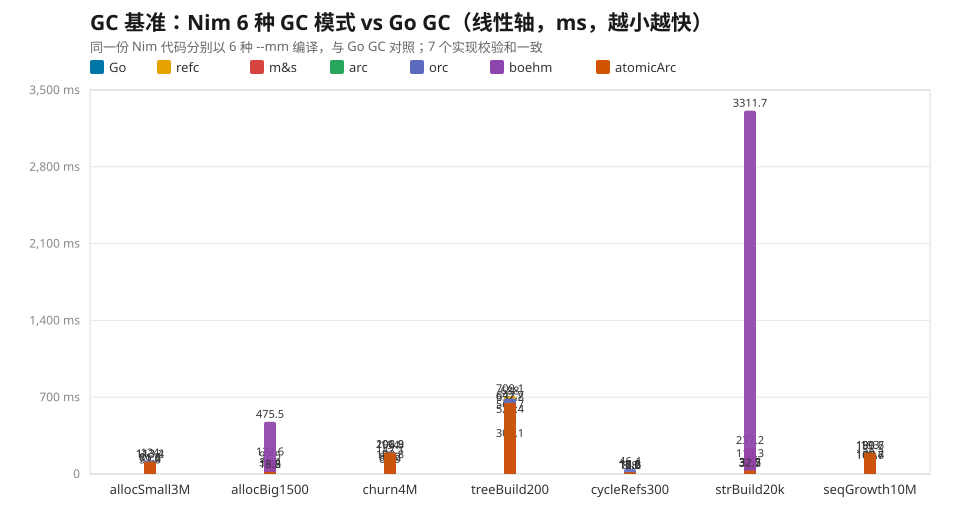

> **系列导航**
> [（一）6 项常规算法对决](/programming-misc/go-vs-nim-algorithms/)
> [（二）大数运算与 GMP 四端](/programming-misc/go-vs-nim-bigint/)
> **（三）6 种 GC 模式全景对比**（本篇）

前两篇讲了常规算法与大数运算，本篇是系列最后一块拼图：**内存管理**。Nim 的一大特色是 GC 可选——同一份代码可以用 6 种不同的内存管理策略编译。加上 Go 的 GC，正好做一场全景对比。


- **没有绝对赢家**：7 项负载的「最快」分布在 5 个实现上。
- **高频小对象分配**：Go **3.0 ms** 遥遥领先，比 Nim 最快的 arc 快约 38 倍。
- **大对象 / 字符串构建**：arc / orc / atomicArc 最快；boehm 在字符串拼接上是灾难（3312 ms）。
- **指针结构**（树、循环引用、频繁释放）：boehm 三项全场第一，Go 次之。


## 一、测试设计

同一份 Nim 基准代码分别以 `--mm:refc / markAndSweep / arc / orc / boehm / atomicArc` 编译（`--mm:go` 因本机缺 `libgo.dll` 不可运行，`--mm:none` 无 GC 不可比），再与 Go 1.26.7 自带 GC 对照。7 项负载覆盖小/大对象分配、分配-释放交替、二叉树、循环引用、字符串构建、seq 增长；7 个实现校验和完全一致。



boehm 在 `strBuild20k` 上高达 3312 ms，一根柱子就把其余 48 根压成了紧贴轴线的短线。剔除 boehm 再画一张，其余 6 个实现之间的差异才看得清：


| 基准 | Go | refc | mark&sweep | arc | orc | boehm | atomicArc |
| --- | ---: | ---: | ---: | ---: | ---: | ---: | ---: |
| allocSmall3M（300 万小对象） | **3.0** | 71.6 | 59.8 | 113.2 | 124.0 | 81.5 | 113.4 |
| allocBig1500（1500 个 1 MiB） | 97.5 | 33.4 | 132.6 | 18.5 | **18.3** | 475.5 | 18.8 |
| churn4M（400 万次分配-释放） | 108.8 | 147.1 | 85.2 | 194.0 | 200.9 | **64.9** | 196.8 |
| treeBuild200（200 棵满二叉树） | 521.4 | 709.1 | 564.7 | 632.8 | 688.0 | **301.1** | 647.7 |
| cycleRefs300（300 个循环链表） | 14.2 | 15.6 | 12.6 | 12.2\* | 46.4 | **8.8** | 16.6 |
| strBuild20k（2 万次字符串拼接） | 117.3 | 39.5 | 237.2 | **31.6** | 32.2 | 3311.7 | 32.7 |
| seqGrowth10M（1000 万次 push） | 102.6 | 100.7 | **99.0** | 189.7 | 190.6 | 120.2 | 193.0 |
| **7 项合计** | **965** | 1117 | 1191 | 1192 | 1300 | 4364 | 1219 |

\* arc 不回收循环引用，cycleRefs 的「快」是以内存泄漏为代价；orc 带循环收集器（比 arc 慢 3.8×），追踪式 GC 全部正常回收。

## 二、两类 GC 的根本差异

理解这张表，只需要记住一件事：

- **追踪式 GC**（refc / mark&sweep / boehm / Go）：**分配便宜，回收周期性**。死亡对象批量扫描时才处理，空闲时不付额外代价。
- **引用计数**（arc / orc / atomicArc）：**每个对象即时增减计数并释放**。释放时机确定、内存峰值低，但短生命周期对象的「增-减-释放」全都要计入成本，反而更贵。

这个差异解释了表中几乎所有现象。

## 三、按负载看结果

**高频小对象分配 —— Go 断层第一**
Go 3.0 ms 对比 Nim 最快的 refc 71.6 ms、arc 113.2 ms。结论很直接：**在 Nim 里不要用 arc / orc 做小对象流水**。

**大对象 / 字符串构建 —— arc 系最快，boehm 是灾难**
1 MiB 大对象：arc 系约 18.5 ms，boehm 475.5 ms。字符串拼接：arc 31.6 ms，boehm 3311.7 ms——慢了两个数量级。

**指针结构 —— boehm 三项全场第一**
二叉树 301.1 ms、循环引用 8.8 ms、交替释放 64.9 ms，Go 在这三项上都是次优。指针密集的图/树结构正是保守式 GC 的舒适区。

**seq 增长 —— refc / m&s / Go 基本持平**
99~103 ms，arc 系约 190 ms：扩容需要搬移元素并维护每个元素的引用计数。

## 四、选型建议

一句话总结：**高频小对象 → Go / refc；大块内存与字符串流 → arc / orc；大量指针结构 → boehm / Go；循环引用 → Go / orc / refc（arc 会泄漏，勿用）；seq 频繁增长 → m&s / Go；综合均衡 → orc（Nim 2.x 默认）**。

## 五、系列总结

把三篇五轮测试放在一起，可以给出相当务实的结论：

| 场景 | 推荐 | 理由 |
| --- | --- | --- |
| 常规计算密集算法 | Nim / Go 皆可 | 6 项合计仅差 3.5%，按生态选 |
| 高频小对象分配 | **Go** | 比 Nim 最快方案还快一个数量级 |
| 大数乘法 / 模幂（只用标准库） | **Go math/big** | 深度优化碾压生态库 |
| 大数模幂（可引 GMP） | Nim + GMP FFI / C | FFI 开销 ≈ 0，GMP powm 快 58% |
| 除法 / 开方密集（π 类） | **GMP** | 比 math/big 快 7.8~11.3×，开方段 91× |
| 高性能 FFI 调用 | Nim dynlib | cgo 在百万次小调用场景慢 45% |
| 默认 GC 选择 | Nim 用 orc；高频小对象换 refc | 无全局最优 |

一句话：**常规负载 Go 与 Nim 打平；一旦进入大数、FFI 调用模式、GC 形态这些"深水区"，差距就不是语言本身的锅，而是运行库与算法选择的锅**。Go 的 `math/big` 和 GC 打磨得深，Nim 的 ARC/ORC、FFI 和 C 后端也有自己的主场。

## 六、复现与局限

```powershell
# GC 基准（Go + Nim 6 种 --mm）
powershell -ExecutionPolicy Bypass -File run_gc_benchmark.ps1 -Runs 7
```

- 单机单测：i9-11950H + Windows 10，其他平台/版本结果可能不同。
- 单线程对比，未测多核、并发与内存峰值（峰值是 arc 系相对优势项，本次未纳入）。
- GC 负载结果与 **Nim 版本强相关**（Nim 2.x 各 `--mm` 后端仍在演进），升级大版本后建议重测。
- 测试工程位于本机 `benchmark/nimgolang`，环境与方法见[第一篇](/programming-misc/go-vs-nim-algorithms/)。
