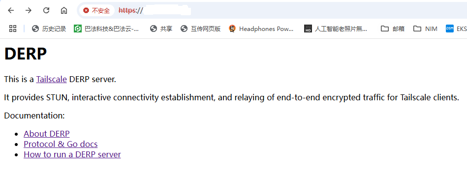
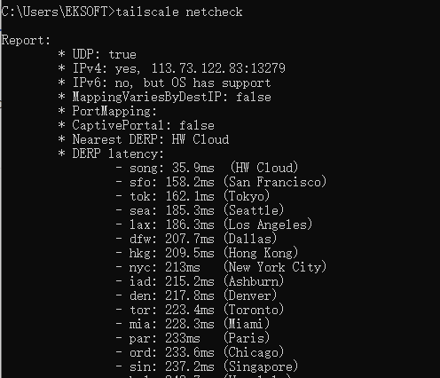
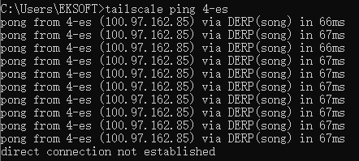

既然tailscale官方derp源代码支持了IP作为HostName，当然需要测试一番。经过一番摸索，终于在阿里云，华为云成功部署。其中阿里云装的debian 12，华为云装的ubuntu 22.04.下边简单说一下步骤。

首先，第一个问题就是debian/ubuntu的仓库里的golang版本是不够的。都是1.18、1.19这样的版本。需要安装最新的golang版本。golang官方最新的版本是1.23.4，tailscale需要1.23（真够激进的）所以第一件事，就是安装最新的golang。

好在Debian有backport机制，ubuntu有最新的snap包，安装都很简单：

```bash
apt search go-1.23
Sorting... Done
Full Text Search... Done
golang-1.23/stable-backports,now 1.23.3-2~bpo12+1 all [installed]
  Go programming language compiler - metapackage

golang-1.23-go/stable-backports,now 1.23.3-2~bpo12+1 amd64 [installed,automatic]
  Go programming language compiler, linker, compiled stdlib
```

所以直接安装

```bash
apt install golang-1.23
```

安装后需要设置一下环境变量：

```bash
export PATH=$PATH:/usr/lib/go-1.23/bin
```

推荐写到.bashrc，以后每次登录都会加载这个环境变量。检查一下环境变量：

```bash
 echo $PATH
/usr/local/sbin:/usr/local/bin:/usr/sbin:/usr/bin:/sbin:/bin:/usr/lib/go-1.23/bin
```

ubuntu的snap包自带最新版的golang，用下边命令安装：

```bash
 snap install go --classic
```

ubuntu的snap包安装后不用任何设置就可以使用了。安装完成后运行go version看看版本号：

```bash
go version
go version go1.23.4 linux/amd64
```

这时候如果直接用go install会不成功，还是众所周知的原因，所以先配个代理：

```bash
go env -w GOPROXY=https://goproxy.cn,direct
```

然后运行tailscale的官方安装命令：

```bash
go install tailscale.com/cmd/derper@latest
```

安装就完成了。现在derper命令在~/go/bin下，可以直接拷到任意目录，例如/usr/bin下

```bash
 sudo cp ~/go/bin/derper /usr/bin/
```

接下来就是配置，首先生成证书，证书是必须的，因为tailscale走的SSL加密。但是不是网上那种只有3个月的免费证书或者花钱买的证书，而是自己做的证书，可以是10年，因为这个证书只是用来加密数据的（等同于密码），所以不存在什么安全问题，但是这个证书需要包含IP信息：

```bash
DERP_IP="12.12.12.12"
openssl req -x509 -newkey rsa:4096 -sha256 -days 3650 -nodes -keyout ${DERP_IP}.key -out ${DERP_IP}.crt -subj "/CN=${DERP_IP}" -addext "subjectAltName=IP:${DERP_IP}"
```

把上边的DERT\_IP后边的IP地址改成自己VPS的地址。屏幕上输出一段乱码后，会在当前目录下生成两个文件，一个key文件，一个crt文件，可以复制到任何目录。这里因为是测试就复制了，现在启动derper服务器：

```bash
derper --hostname="12.12.12.12" -certmode manual -certdir ./
```

hostname一定要是改成你的IP，因为只有用IP他才不判断证书，否则他会说证书不匹配。

现在配置就完成了。可以在浏览器打开这个网址看看，如果不行说明VPS没设置对，需要打开TCP的80、443端口，UDP的3478端口（UDP！UDP！UDP！别问我为什么强调这个）正常是这样子的：



至于上边的不安全之类，无视就行了，因为不是正规机构发的证书，浏览器肯定叫唤。

然后再Tailscale的控制台加入我们节点的信息：

```json
    "derpMap": {
        //"OmitDefaultRegions": true,  //加入这个会只用自己的节点
        "Regions": {
            "901": {
                "RegionID":   901,
                "RegionCode": "song",
                "RegionName": "HW Cloud",
                "Nodes": [
                    {
                        "Name":     "901a",
                        "RegionID": 901,
                        "HostName":         "eksoft", //这个随便写
                        "IPv4":             "12.12.12.12", //改成自己的IP
                        "InsecureForTests": true,
                    },
                ],
            },
        },
    },
```



测试下延时，只有36ms。



来回66ms，加速还是很明显的。
